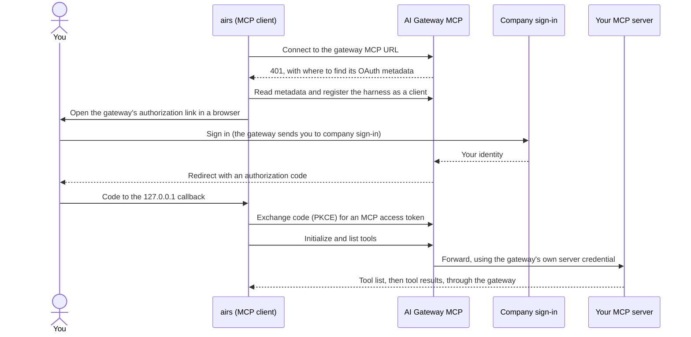
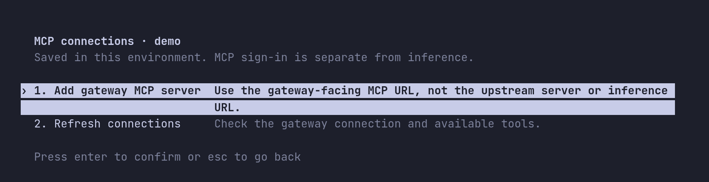
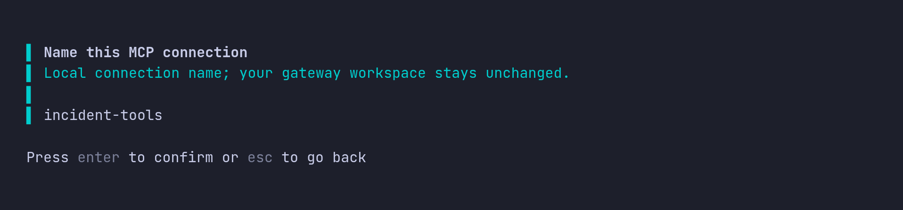
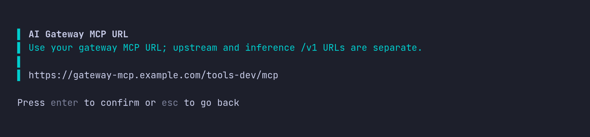
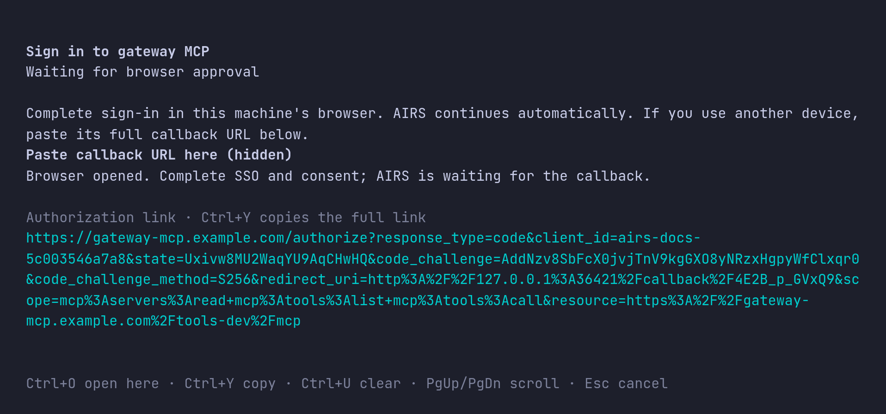
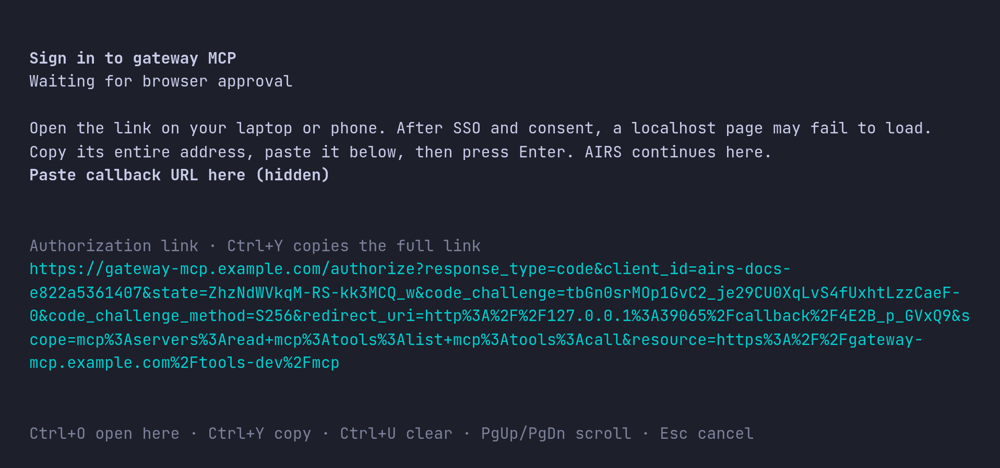
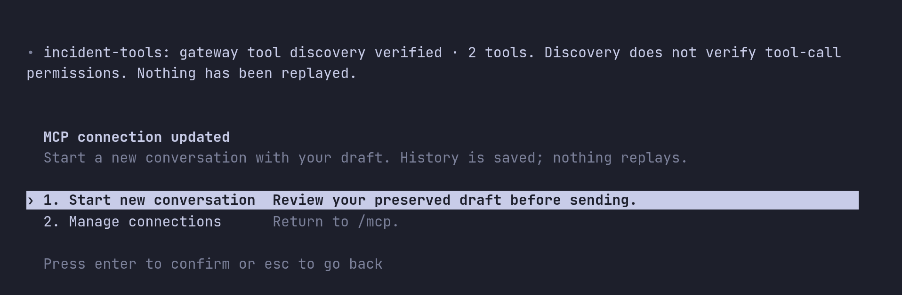
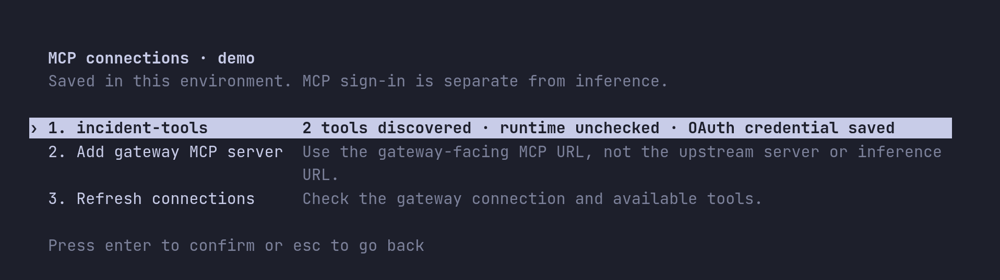
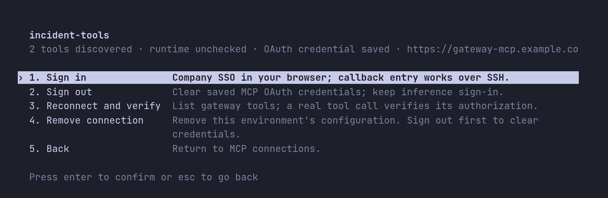

# Getting started with MCP servers and OAuth

By the end of this page the agent will be calling tools on a remote MCP server
that your organization hosts, through Prisma AIRS AI Gateway, signed in with
OAuth as you. You add the server, sign in once in your browser, and then prove the
connection with a real, read-only tool call.

The running example is `incident-tools`, a self-hosted incident-management MCP
server that exposes `list_incidents` and `get_incident`. Your server and its tools
will differ; the steps do not.

| Guide | Use it when |
| --- | --- |
| [Workspace API key](https://github.com/cdot65/prisma-airs-harness/blob/main/GETTING-STARTED.md) | You want the fewest moving parts, or this is your first setup. |
| [Company SSO](https://github.com/cdot65/prisma-airs-harness/blob/main/GETTING-STARTED-SSO.md) | Your administrator has set up Keycloak or Entra sign-in for the gateway. |
| **MCP servers with OAuth** (this page) | Inference works and you want to connect a remote tool server. |

Start here only once inference works. Either getting started guide gets you
there, and this page works the same with a workspace key or company SSO.

## How MCP sign-in works

Your MCP server does not face the harness directly. Your administrator publishes
it through AI Gateway, which gives it a gateway MCP URL. The harness connects to
that URL, and the gateway decides who may reach the server and which tools they
may call.



Three things are worth knowing before you start, because each explains a step
that would otherwise look redundant.

**MCP has its own credential.** Your inference key or SSO token is never sent to
an MCP server. The MCP sign-in produces a separate token, for a separate audience,
with separate scopes. A working inference sign-in therefore tells you nothing
about tool access.

**The harness never talks to your server directly.** It only knows the gateway MCP
URL. The gateway holds its own credential for your server, applies workspace
grants and policy, and records every call. Pointing the harness at the server's
own URL would skip all of that, so the harness does not do it, even as a fallback.

**Four states, not one.** A connection can be *saved* but not signed in, *signed
in* with no tools discovered, *discovered* but not authorized for a particular
tool, or fully *working*. Each has a different fix, which is why Part 2 checks
them in that order and ends with a real tool call.

The harness handles the OAuth details for you. It reads the gateway's published
OAuth metadata, registers itself as a public client (by dynamic client
registration, unless the gateway supports client metadata documents), and
requests these scopes:

| Scope | Allows |
| --- | --- |
| `mcp:servers:read` | Reading the server's details |
| `mcp:tools:list` | Discovering the tools you may use |
| `mcp:tools:call` | Calling those tools |

Scopes let the harness *ask*. The gateway's grant for your account decides what
it actually receives. The gateway is also the authorization server: the sign-in
link points at the gateway, which sends you on to company sign-in.

## Before you start

From your administrator:

| Value | Example | Notes |
| --- | --- | --- |
| Gateway MCP URL | `https://gateway-mcp.example.com/tools-dev/mcp` | The gateway-facing URL for your server, usually ending in `/mcp`. Not your server's own URL, and not the inference `/v1` URL. |
| Tools you are granted | `list_incidents`, `get_incident` | So you can tell a missing grant from a broken connection. |

On the gateway side, your administrator must already have:

1. Deployed the MCP server, with its own backend credential limited to the access
   it needs.
2. Published it as an MCP integration in your gateway workspace, including the
   gateway's OAuth client for the server if the server requires one.
3. Granted your account access to the integration and to the tools you need.

[MCP authorization](https://cdot65.github.io/prisma-airs-harness/configuration/mcp/)
covers that setup. Signing in to the gateway does not grant any of it.

You also need a desktop browser, or a second device if you work over SSH, and the
same working credential store that inference uses.

## Part 1: Set up

### 1. Check the MCP URL before you connect

The most common mistake is the wrong URL: the server's own address, the inference
URL, or a path without `/mcp`. The gateway MCP URL answers an unauthenticated
request with `401` and tells clients where its OAuth metadata is, so you can check
it without signing in:

```sh
curl -sS -o /dev/null -D - -X POST https://gateway-mcp.example.com/tools-dev/mcp \
  | grep -i -E '^HTTP|^www-authenticate'
```

Expected output, in the shape the MCP authorization standard defines:

```text
HTTP/2 401
www-authenticate: Bearer resource_metadata="https://gateway-mcp.example.com/.well-known/oauth-protected-resource/tools-dev/mcp"
```

| You see | Meaning |
| --- | --- |
| `401` with `resource_metadata` | The URL is an OAuth-protected MCP endpoint. Continue. |
| `404` | The path is wrong. Check the integration's full URL, including `/mcp`. |
| `200` or a web page | This is not the gateway MCP endpoint, or it does not use OAuth. Ask your administrator for the gateway MCP URL. |
| A TLS or connection error | Network path, DNS or certificate problem. The harness will fail the same way. |

### 2. Open AIRS and add the server

Start a session in the environment you use for inference, then open the MCP
manager:

```sh
airs
```

Enter `/mcp`. The manager lists this environment's connections. With none yet, it
offers **Add gateway MCP server**.



Choose **Add gateway MCP server** and answer two prompts:

1. **Name this MCP connection.** A local name, such as `incident-tools`. It is how
   the connection appears in `/mcp` and in the agent's tool list. It does not
   select anything at the gateway. Use up to 64 letters, digits, hyphens or
   underscores.

   

2. **AI Gateway MCP URL.** The URL you checked in step 1. It must be HTTPS, with no
   credentials, query string or fragment.

   

AIRS saves the connection, reads the gateway's OAuth metadata, registers itself,
and opens the sign-in dialog. The manager always requests the three scopes listed
in [How MCP sign-in works](#how-mcp-sign-in-works). If your administrator gave you
different scope names, add the server
[from the shell](#set-up-from-the-shell-instead) instead.

### 3. Sign in

**Sign in to gateway MCP** shows the authorization link and waits for your browser
to return.



**On your own desktop,** AIRS opens the browser for you. Sign in with your company
account, approve any consent the gateway asks for, and AIRS continues by itself.
If no browser opened, press **Ctrl+O** to try again.

**Over SSH or without a browser,** the dialog tells you to open the link on
another device. Press **Ctrl+Y** to copy the full link and open it on your laptop
or phone. Prefer Ctrl+Y to selecting the wrapped link on screen: selecting a link
that wraps across lines can pick up line breaks or lose part of it, and sign-in
then fails with `MCP authorization did not complete.` After you sign in, the
browser tries to load a `http://127.0.0.1:…/callback` page, which fails because
the harness is on the other machine. That is expected. Copy the full address from
the browser's address bar, paste it into the hidden **Paste callback URL here**
field and press Enter.



Paste the callback only into that field. It is a one-time authorization code, so
keep it out of the conversation and support tickets. Esc cancels; the connection
stays saved, and you can sign in later from `/mcp`.

Choose the same company account you use for inference. If you use a workspace key
for inference, choose the account that holds the MCP grant. The link in the dialog
shows what is being requested: your registered client, PKCE, a `127.0.0.1`
callback (`/callback/` followed by an ID for this attempt), the three scopes and
the MCP server as the `resource`. If the consent page names the client **Codex**,
that is expected: it is the name the harness registers under, inherited from the
open-source client it is built on.

### 4. Start a new conversation

AIRS shows three progress stages: **Completing MCP sign-in…**, **Saving MCP
credential…** and **Connecting and discovering MCP tools…**. When discovery
succeeds, it reports `incident-tools: gateway tool discovery verified · 2 tools`
and offers a new conversation. As that line also says, discovery does not verify
that you may *call* the tools; step 7 does.



Choose **Start new conversation**. A conversation's tool list is fixed when it
starts, so new tools appear only in a new one. Your previous conversation stays
saved, your unsent draft carries over, and nothing is sent or replayed for you.

#### Set up from the shell instead

The same connection can be added from the shell, which is useful for scripts or
when you prefer to see each step's output:

```sh
airs mcp add incident-tools \
  --url https://gateway-mcp.example.com/tools-dev/mcp \
  --scopes mcp:servers:read,mcp:tools:list,mcp:tools:call
```

It prints `Added global MCP server 'incident-tools'.` and `Detected OAuth support.
Starting OAuth flow…`, then opens the browser and prints `Successfully logged in.`
when you finish. If sign-in did not finish, run it on its own. `--no-browser`
prints the link and a hidden `Callback URL` prompt for the pasted address, for SSH:

```sh
airs mcp login incident-tools --no-browser
```

Pass `--scopes` exactly as your administrator specifies. Some gateways publish
different scope names, and the harness keeps whatever you pass for later sign-ins.

## Part 2: Validate

Each check below confirms one of the four states, in order. Stop at the first one
that fails; the later ones depend on it.

### 5. Validate the saved connection

From the shell:

```sh
airs mcp list
```

```text
Name            Url                                            Bearer Token Env Var  Status   Auth
incident-tools  https://gateway-mcp.example.com/tools-dev/mcp  -                     enabled  OAuth
```

| Column | Expect | If not |
| --- | --- | --- |
| **Url** | The gateway MCP URL from step 1 | Remove the connection and add it again with the right URL. |
| **Status** | `enabled` | A `disabled` connection is skipped at startup. |
| **Auth** | `OAuth` | `Not logged in` means sign-in did not finish. Select the connection in `/mcp` and choose **Sign in**. Do not add it again. `Unknown` means the harness could not read the credential store or reach the gateway's OAuth metadata: unlock the credential store, repeat step 1 and run `/doctor`. After `airs logout`, run `airs login` first. |

`OAuth` means a credential is saved. It does not yet show that the gateway accepts
it; the next step does.

### 6. Validate sign-in and tool discovery

In a session, enter `/mcp` again. Opening it checks discovery afresh, and the
connection shows its tool count and that an OAuth credential is saved.
`runtime unchecked` is expected and stays there: this view checks discovery, not
the connection inside your running conversation.



Select the connection to see its actions:



Choose **Reconnect and verify**. It connects to the gateway with the saved token,
initializes the server and lists its tools again, without calling any of them.
Success means the gateway accepts your MCP token and your grant lets you see
tools. To list the tool names in a session, enter `/mcp verbose`.

If the list is missing a tool you expect, the gateway grant does not include it.
That is a gateway change, not something to fix in the harness.

### 7. Validate a real tool call

Discovery proves you can *see* tools. Only a call proves you may *use* them, and
only the transcript proves a call happened: a model can write a plausible answer
without calling anything. In the new conversation, ask for a read-only operation:

> Use the incident-tools MCP connection to list up to five active incidents. Show
> their numbers, short descriptions and priorities. Do not create or update any
> records.

Check the transcript, not just the answer. A successful call looks like this,
with your own arguments and result:

```text
• Called incident-tools.list_incidents({"state":"active","limit":5})
  └ INC0010042 · Payment API latency · P2 …
```

A failed call shows `└ Error:` and the reason in the same place. In detail:

- There is a tool call to `list_incidents` on `incident-tools`.
- The call returned a result. An empty list is a valid result if there are no
  active incidents.
- If the agent asks for approval to run the tool, approve it; that is the harness's
  local approval policy, separate from the gateway's authorization.

A tool error that says you are not authorized means discovery works but the grant
for that operation is missing. Give your administrator the tool name and the time;
the gateway logs show the decision.

### 8. Validate that the sign-in persists

Exit AIRS, start it again, and repeat the read-only request in a new conversation.
It should work without a browser, because the token, and its refresh token if the
gateway issued one, are in your credential store. If AIRS asks you to sign in
again right away, the credential was not saved; check your Keychain or keyring and
run `/doctor`.

Administrators should also test a user *without* the grant and confirm the gateway
denies the call. A check that only ever succeeds does not show that the grant is
doing anything.

## Troubleshoot

AIRS reports MCP failures in the manager with a recovery step. The first sentence
names the stage:

| Message begins | Stage | What to check |
| --- | --- | --- |
| `The MCP endpoint is invalid.` | URL | Use the full HTTPS gateway MCP URL, without credentials or query parameters. |
| `MCP authorization discovery failed.` | Discovery | The URL is not the gateway MCP endpoint, or its OAuth metadata is not published. Repeat step 1. |
| `The MCP authorization endpoint could not be reached.` | Network | DNS, TLS and network access to the gateway and the sign-in service. |
| `MCP authorization did not complete.` | Sign-in | Retry **Sign in**. If it fails again, the administrator checks the gateway OAuth client, scopes and redirect settings. |
| `MCP sign-in was cancelled.` | Sign-in | Choose **Sign in** from `/mcp` when ready. |
| `MCP sign-in expired.` | Sign-in | The link was not used in time. Choose **Sign in** again for a fresh link. |
| `(The) MCP operation timed out` | Sign-in or discovery | Retry from `/mcp`. If sign-in was pending, choose **Sign in** for a fresh link. |
| `MCP configuration could not be read or saved.` | Local configuration | Run `/doctor` and check access to the environment's files. |
| `The MCP credential operation failed.` | Storage | Unlock the Keychain or keyring, run `/doctor`, then retry. |
| `… denied this MCP request (HTTP 403).` | Authorization | Your account's workspace and MCP grants. |
| `A gateway policy blocked this MCP request (HTTP 446).` | Policy | The trace in the gateway logs names the policy. |
| Unavailable, rate-limited or no specific cause | Gateway or sign-in service | Wait, then run `/doctor` and refresh `/mcp` before retrying. |

When a message ends with `The connection was saved; it may still need sign-in. Do
not add it again.`, select the existing connection in `/mcp` and choose **Sign in**.
Adding a second one with the same name is refused.

## Renew, sign out and remove

| Task | In a session | From the shell |
| --- | --- | --- |
| Sign in again when a token can no longer be renewed (AIRS also offers this by itself when a tool call needs it) | `/mcp` → the connection → **Sign in**, or `/signin` | `airs mcp login incident-tools` |
| Check discovery again | `/mcp` → the connection → **Reconnect and verify** | — |
| Sign out, keeping the connection | `/mcp` → the connection → **Sign out** | `airs mcp logout incident-tools` |
| Remove the connection | `/mcp` → the connection → **Remove connection** | `airs mcp remove incident-tools` |

Sign out before you remove a connection if you also want its saved token cleared
from this machine; removing only deletes the configuration. Neither signs you out
of inference. The reverse is different: `airs logout` stops all MCP use in the
environment until you sign in again, but keeps the MCP tokens, so connections
work again after `airs login` without a new browser sign-in. None of these revokes
access at the gateway. To end access completely, your administrator removes your
grant.

Two details matter when you keep several environments:

- Connections belong to one environment. Add the server again in each environment
  that needs it.
- The saved MCP token is keyed by connection name and URL for your operating system
  user. Two environments with the same name and URL share it, so signing out in one
  signs out both. Use different names if you need separate MCP identities.

### Environments created before native MCP storage

New environments save MCP tokens in the operating system's credential store. An
environment from an earlier preview may still use its original storage mode, which
upgrades keep. To check, run `airs env show`, open `config.toml` in its
`state_directory`, and look for this top-level setting, above any `[table]`
headers:

```toml
mcp_oauth_credentials_store = "keyring"
```

If it is missing or different and you want native storage, first sign out of every
MCP connection in `/mcp` while the old mode is still set. Then exit AIRS, set the
value, reopen the environment and sign in to each connection again. Changing the
setting does not move or delete existing tokens, which is why the sign-out comes
first. Do not copy token files.

## Commands in this guide

| Command | What it does | Changes anything? | Sends a request? |
| --- | --- | --- | --- |
| `curl -X POST <MCP URL>` | Checks the URL is an OAuth-protected MCP endpoint | No | To the gateway, unauthenticated |
| `/mcp` → **Add gateway MCP server** | Saves the connection, registers and signs in | Saves configuration and token | Discovery, registration, sign-in and tool discovery |
| `airs mcp add NAME --url URL --scopes …` | The same from the shell | Saves configuration and token | Discovery, registration and sign-in; no tool discovery (check with step 6) |
| `airs mcp login NAME [--no-browser]` | Signs in to a saved connection | Saves the token | Sign-in |
| `airs mcp list` | Lists connections, their status and auth state | No | Only for a connection with no saved token: unauthenticated OAuth discovery |
| `/mcp` → **Reconnect and verify** | Initializes the server and lists tools | No | Tool discovery, no tool call |
| `airs mcp logout NAME` | Deletes the saved MCP token | Deletes the token | No |
| `airs mcp remove NAME` | Deletes the connection's configuration | Deletes configuration | No |
| `airs env show` | Shows the environment's state directory | No | No |

## What to do next

- **Understand the gateway side** of MCP authorization, and how an administrator
  publishes a server, in
  [MCP authorization](https://cdot65.github.io/prisma-airs-harness/configuration/mcp/).
- **See every place a credential is used**, and which one covers what, in
  [Architecture](https://cdot65.github.io/prisma-airs-harness/guides/architecture/).
- **Run the full acceptance checks** for a deployment in
  [Acceptance validation](https://cdot65.github.io/prisma-airs-harness/validation/acceptance/).
