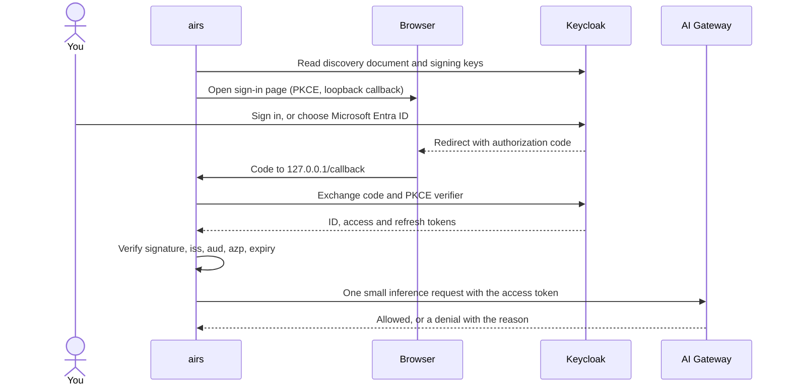
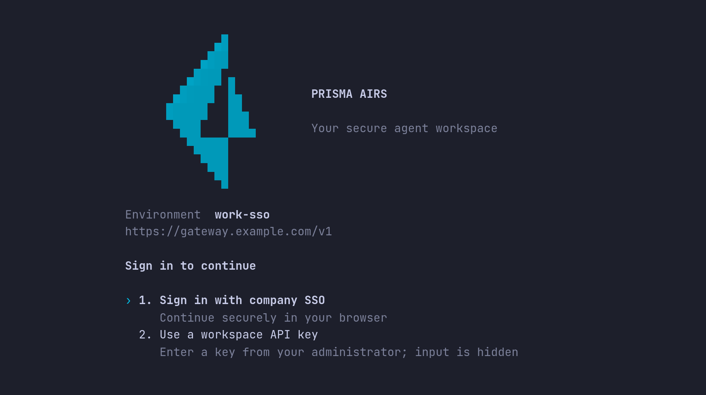
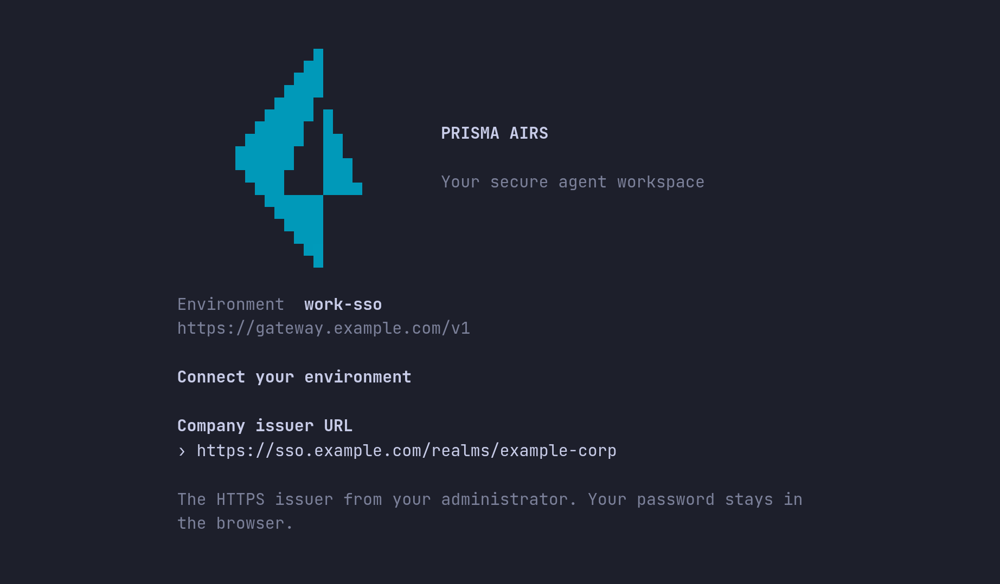
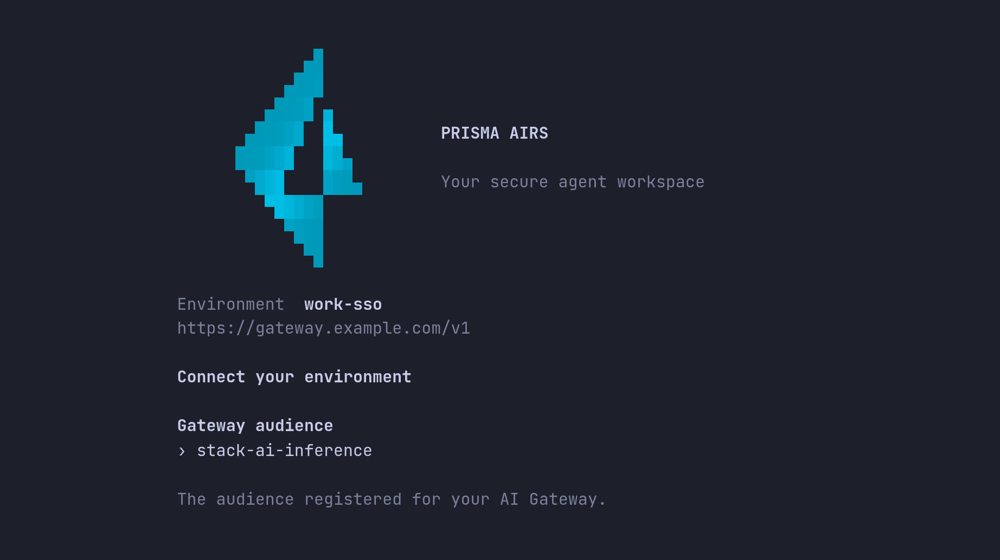
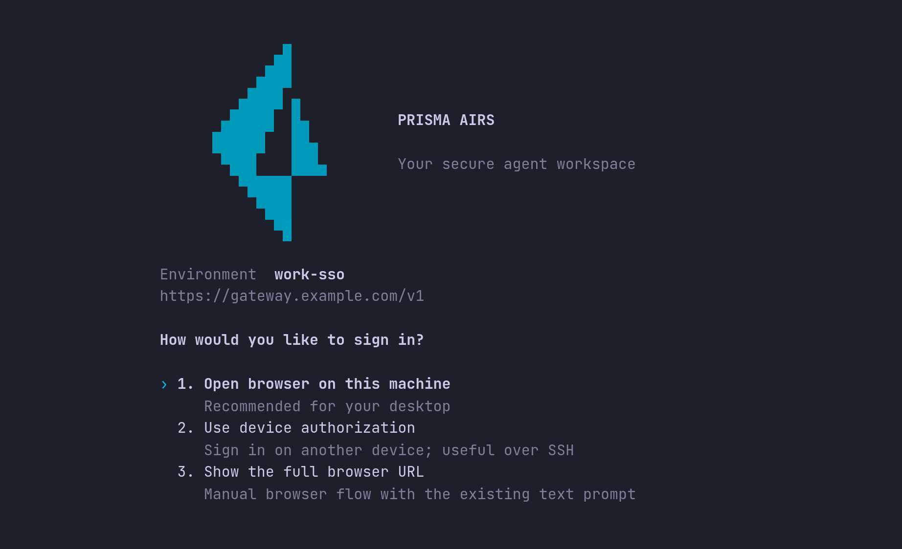
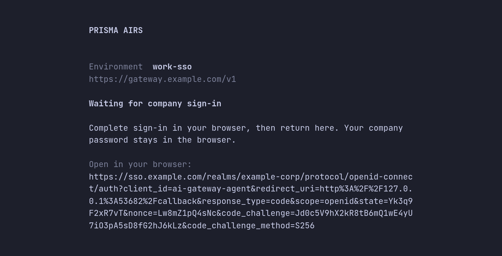
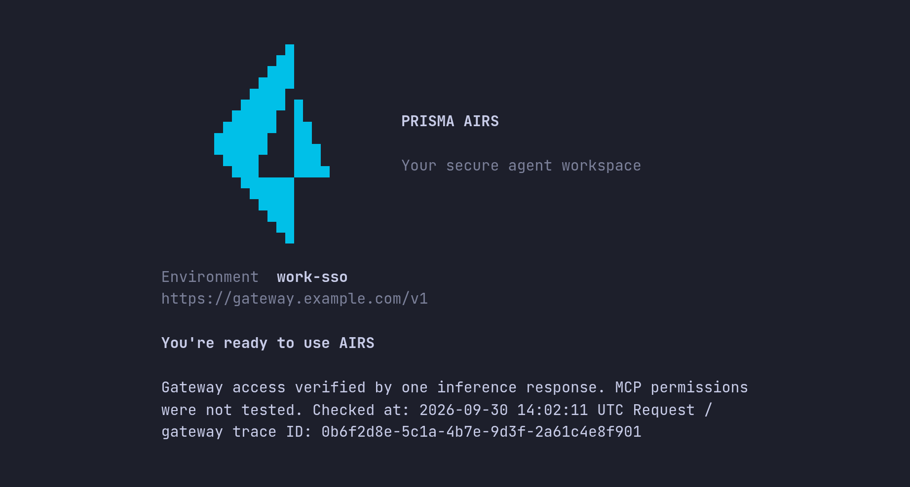
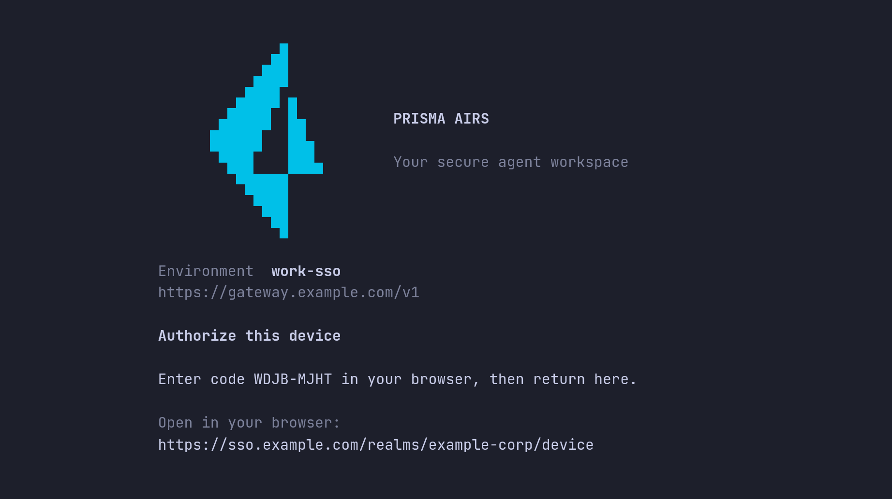

# Getting started with company SSO

By the end of this page you will have signed the harness into Prisma AIRS AI
Gateway as yourself, using your company identity provider instead of a shared
key. You enter the public settings your administrator gives you, sign in once in
your browser, and then confirm that the token the harness received carries what the gateway needs.

The examples use Keycloak as the company issuer. If your company signs in with
Microsoft Entra ID, the steps are the same: Entra sits behind Keycloak, and you
choose it on the Keycloak sign-in page.
[Signing in with Microsoft Entra ID](#signing-in-with-microsoft-entra-id) explains why.

| Guide | Use it when |
| --- | --- |
| [Workspace API key](https://github.com/cdot65/prisma-airs-harness/blob/main/GETTING-STARTED.md) | You want the fewest moving parts, or this is your first setup. |
| **Company SSO** (this page) | Your administrator has set up Keycloak or Entra sign-in for the gateway. |
| [MCP servers with OAuth](https://github.com/cdot65/prisma-airs-harness/blob/main/GETTING-STARTED-MCP.md) | Inference works and you want to connect a remote tool server. |

This page starts after installation. If `airs --version` does not work yet, do
[step 1 of the workspace API key guide](https://github.com/cdot65/prisma-airs-harness/blob/main/GETTING-STARTED.md#1-install-the-harness)
first.

## How SSO sign-in works

The harness is a *public* OIDC client: it has no client secret, so it protects the
sign-in with PKCE instead. Your browser signs in to Keycloak, Keycloak returns the
harness an access token (a signed JWT), and the harness sends that token to the
gateway with every request.



The token is checked twice, in two places, and each check can fail without the
other:

- **The harness checks that the token was issued for this gateway.** Before it saves
  anything, it verifies the signature against Keycloak's published keys and checks
  that the issuer (`iss`) is exactly the URL you entered, the audience (`aud`)
  includes the audience you entered, and the authorized party (`azp`) is your
  client ID. It also requires an RS256 signature and checks the ID token, whose
  `sub` must match the access token's. Any failure stops sign-in before any
  credential is saved. A wrong `azp` is named in the error; the other access-token failures
  all report `access JWT verification failed`, most often because the audience is
  missing.
- **The gateway checks that you are allowed.** It validates the same token again,
  then reads the claims your administrator mapped into it: the inference scope,
  your gateway workspace and your role. A token can pass the harness's check and
  still be refused here, which is why sign-in ends with a real request.

The harness asks Keycloak only for the `openid` scope. It never requests the
audience or the gateway claims itself; Keycloak adds them because your
administrator attached them to the harness client. That is why a missing claim is
fixed in Keycloak, never in the harness. The harness then sends the access token
to the gateway as a bearer credential, and renews it with the refresh token.

## Before you start

Your administrator gives you four public values. None of them is a secret, and
there is no client secret for you to enter.

| Setting | Example | What it is |
| --- | --- | --- |
| Gateway URL | `https://gateway.example.com` | Where inference goes. Enter it without `/v1`. |
| Issuer URL | `https://sso.example.com/realms/example-corp` | Your Keycloak realm. No trailing slash. |
| Client ID | `ai-gateway-agent` | The public client the harness signs in as. |
| Audience | `stack-ai-inference` | The resource the token must be issued for. |

The examples are not a live tenant. Copy your administrator's values exactly: the
harness compares them character for character with what Keycloak publishes.

You also need:

- **An account that may invoke models.** Signing in proves who you are; it does
  not grant model access. Your administrator adds you to the group that carries the
  inference role and enrolls you in the gateway workspace.
- **A desktop browser**, or a second device for [signing in over SSH](#sign-in-over-ssh).
- **A working credential store.** The harness keeps your SSO credential in the
  macOS Keychain or, on Linux, an unlocked Secret Service keyring. It checks the
  store before opening the browser, and there is no plaintext fallback.
- **`curl` and `jq`** for the check in step 1. Without `jq`, drop the `| jq …`
  part and read the `issuer` field in the raw JSON.

## Part 1: Set up

### 1. Check the issuer before you sign in

Most SSO failures come from an issuer URL that is wrong or differs by one
character. You can check it without signing in by reading the realm's discovery
document, which is public:

```sh
issuer=https://sso.example.com/realms/example-corp
curl -fsS "$issuer/.well-known/openid-configuration" \
  | jq '{issuer, pkce: .code_challenge_methods_supported, device: .device_authorization_endpoint}'
```

Expected output:

```json
{
  "issuer": "https://sso.example.com/realms/example-corp",
  "pkce": ["plain", "S256"],
  "device": "https://sso.example.com/realms/example-corp/protocol/openid-connect/auth/device"
}
```

| Field | Must be | If not |
| --- | --- | --- |
| `issuer` | Identical to the URL you will enter, with no trailing `/` | Use the value printed here. A URL that reaches this document but differs from `issuer` fails sign-in with `discovery issuer mismatch`. |
| `pkce` | A list that includes `S256` | Ask your administrator to enable PKCE S256. |
| `device` | A URL, if you will sign in over SSH | Device sign-in is not offered by this realm. Use a desktop browser. |

If `curl` fails, the harness will fail the same way, because it makes the same
request: a `404` means the realm name or path is wrong (`issuer discovery
rejected`), and a connection error means the network path (`issuer discovery
unavailable`). Fix that first.

### 2. Create an environment and choose company SSO

An environment is a local profile: where to connect, which credential to use and
where your conversations are kept. Create one for SSO:

```sh
airs env create work-sso
```

The first screens are the same as in the workspace API key guide: keep or change
the name, enter the gateway URL without `/v1`, and choose **Create environment and
sign in**. Running `airs` on a fresh installation opens the same screens.

On **Sign in to continue**, choose **Sign in with company SSO**. It is already
selected, so press Enter.



### 3. Enter the issuer, client ID and audience

AIRS asks for the three identity settings one at a time, on screens titled
**Connect your environment**:

1. **Company issuer URL**, the realm URL you checked in step 1.
2. **Public client ID**, for example `ai-gateway-agent`.
3. **Gateway audience**, for example `stack-ai-inference`.

Paste each value and press Enter. Ctrl+U clears the field and Esc cancels.





Each field must be a single line with no spaces. The issuer must also be an HTTPS
URL with no query, fragment or trailing slash; otherwise the screen says so before
it moves on. AIRS saves these public settings to the environment before signing
in, so if you run sign-in again later it offers **Continue with saved settings**.

### 4. Sign in in your browser

On **How would you like to sign in?**, choose how to reach the sign-in page.



- **Open browser on this machine** is the normal choice on a desktop.
- **Use device authorization** is for SSH and headless machines. See
  [Sign in over SSH](#sign-in-over-ssh).
- **Show the full browser URL** closes the screen and prints the link for you to
  open. The browser still has to reach this machine's loopback callback, so this
  only helps when the browser runs on the same machine.

AIRS now shows its progress, one stage at a time:

| Stage | What is happening |
| --- | --- |
| **Checking credential storage** | Confirms the Keychain or keyring can save a credential, before you sign in. |
| **Contacting company sign-in** | Reads the issuer's discovery document and signing keys. This is where issuer, PKCE and hostname problems are reported. |
| **Waiting for company sign-in** | The browser is open. Sign in there. The link is also shown in case the browser did not open. |
| **Saving sign-in** | The token passed the harness's checks and is being stored. |
| **Credential saved · checking gateway access** | One small inference request with your token. |



The link shows the request described in [How SSO sign-in works](#how-sso-sign-in-works):
your client ID, `scope=openid`, a PKCE challenge and a `127.0.0.1` callback on a
free port. Sign in on the Keycloak page as the person who should own this
environment. If your company signs in with Entra, choose the Entra button there;
its label is whatever your administrator named it, such as **Microsoft Entra ID**.
Your password is only ever typed into that page.

When the browser shows **You may return to AIRS Harness to finish signing in**,
switch back to the terminal. That page means only that the harness received
Keycloak's reply, which can also be a refusal; the terminal reports the result.
An unfinished browser sign-in times out after five minutes.

### 5. Finish the first-run screens

**You're ready to use AIRS** means the credential was saved and the gateway
accepted one real inference request made with your token. The screen shows when the
check ran, in UTC, and a trace ID you can look up in the gateway logs.



Continue past the optional red-team judge screen, trust your project directory,
and the session opens. The header's **identity** line reads `OIDC · alex`, with
your Keycloak username, where a key-based environment shows `workspace credential`.

If the title is **Credential saved · gateway access needs attention** instead,
sign-in worked but the gateway refused the request. Signing in again will not
change that. Choose **Exit and fix gateway access**, then use step 8 to read the
reason.

If sign-in itself fails, AIRS shows **Sign-in needs your attention** with the
error, and offers **Try sign-in again** or **Back to sign-in options**.
[Troubleshoot sign-in](#troubleshoot-sign-in) lists each error.

#### Set up from the shell instead

Every screen above has a command equivalent, for scripts and repeatable setups:

```sh
airs env create work-sso --gateway-url https://gateway.example.com/v1
airs --environment work-sso login \
  --issuer-url https://sso.example.com/realms/example-corp \
  --oidc-client-id ai-gateway-agent \
  --audience stack-ai-inference
airs --environment work-sso doctor --verify-access
```

- `env create` with `--gateway-url` saves and selects the environment without
  signing in. Here the URL includes `/v1`, because it is the inference API root.
- `login` opens the browser and prints `Signed in through <issuer>. Verified
  subject: <subject>. Credentials stored in the OS store.` Add `--no-browser` to
  print the URL instead of opening it, or `--device-auth` for
  [SSH](#sign-in-over-ssh).
- `doctor --verify-access` is the separate access check from step 8.

## Part 2: Validate

Setup ends with one successful request. These checks show *why* it works, so that
when something changes later you know which layer to look at. They either read
local state or send at most one small request.

### 6. Validate the saved identity

```sh
airs --environment work-sso login status
```

Expected output:

```text
Prisma AIRS Harness 0.1.3
State: /home/alex/.airs-harness/environments/7a674da4-381b-4d8b-9ec7-8a1fe6b2b190
Gateway: https://gateway.example.com/v1
Authentication: OIDC; saved identity metadata (not freshly authenticated): issuer "https://sso.example.com/realms/example-corp"; subject "3f1c9a2e-5b7d-4e8f-a1c2-9d0e6b4f7a31"; audience "stack-ai-inference"
Credential configuration: Saved; availability and gateway access not checked. Run airs doctor --verify-access to check access.
```

This is a local read; nothing is sent. Check that:

- **Gateway** ends in `/v1` and is your administrator's gateway.
- **Authentication** starts with `OIDC`. `Workspace credential` means this
  environment still uses a key.
- **issuer** and **audience** are exactly your administrator's values.
- **subject** is your Keycloak user ID. It is the `sub` claim in your token, and
  it is how the gateway knows who you are.

As the last line says, a saved identity is not proof that the token still works.
The next two steps check that.

### 7. Validate the token's claims

The harness has already rejected any token with the wrong signature, issuer,
audience or client. The gateway needs more than that. The harness never displays
your token, so the way to see exactly what the gateway receives is Keycloak's
token preview, which needs Keycloak admin access. An administrator opens your
realm, goes to **Clients**, opens the harness client, chooses the **Client scopes**
tab and then **Evaluate**, selects your user and opens **Generated access token**.
If you are not a Keycloak administrator, ask yours to run this preview for your
account and compare it with the table below.

A token that the reference gateway policy accepts looks like this (values are
examples, and standard claims such as `exp` and `iat` are omitted):

```json
{
  "iss": "https://sso.example.com/realms/example-corp",
  "aud": "stack-ai-inference",
  "azp": "ai-gateway-agent",
  "sub": "3f1c9a2e-5b7d-4e8f-a1c2-9d0e6b4f7a31",
  "scope": "openid profile email completions.write",
  "portkey_workspace": "agent-production",
  "harness_inference_roles": ["invoke"]
}
```

| Claim | Why it must be there | Checked by |
| --- | --- | --- |
| `iss` | Names the realm that signed the token | Harness and gateway |
| `aud` | Says the token is meant for the gateway | Harness and gateway |
| `azp` | Says which client asked for the token | Harness and gateway |
| `sub`, `iat`, `exp` | Who you are and how long the token is valid | Harness and gateway |
| `scope` includes `completions.write` | Permits inference | Gateway |
| `portkey_workspace` | Names the gateway workspace the request belongs to | Gateway |
| `harness_inference_roles` includes `invoke` | Says you may invoke models | Gateway |

These claim names come from the reference setup in
[Keycloak inference sign-in](https://cdot65.github.io/prisma-airs-harness/configuration/keycloak/).
Your gateway's JWT policy is what counts, so if your administrator uses different
names, compare against theirs.

Never paste a live token into an online JWT decoder: it is a working credential
until it expires. The Keycloak preview is safe because it never issues a token
anyone can use.

### 8. Validate gateway access

Now send one real request:

```sh
airs --environment work-sso doctor --verify-access
```

`doctor` prints one line per check. The `gateway_access` line, with its time and
trace ID, is the one that matters here:

```text
Checking gateway access with one minimal inference request (up to 16 output tokens). This sends only a fixed connectivity message, with no local files or tools. The request asks the provider not to store the response; gateway logging policy still applies.
Prisma AIRS Harness 0.1.3 — doctor
State: /Users/alex/.airs-harness/environments/7a674da4-381b-4d8b-9ec7-8a1fe6b2b190
PASS credential_service: Credential service responded. Access to the saved credential is not verified; choose Verify gateway access.
PASS credential_cleanup: No pending credential cleanup
PASS local_tools: Required local executables found; this does not exercise kernel sandbox support
PASS configuration: https://gateway.example.com/v1
PASS capabilities: Local catalog readable; backend limits still apply
PASS gateway_health: HTTPS/HTTP health response successful; inference and policy not exercised
PASS mcp_configuration: 0 configured server(s); use /mcp and invoke a tool to verify remote authorization
PASS typesafe_judge: Not configured (optional). Set with airs env typesafe set
PASS gateway_access: Gateway access verified by one inference response. MCP permissions were not tested.
Checked at: 2026-09-30 14:02:11 UTC
Request / gateway trace ID: 0b6f2d8e-5c1a-4b7e-9d3f-2a61c4e8f901
```

This is macOS output; Linux adds a `linux_user_namespaces` line for its sandbox.
The workspace API key guide explains [each line](https://github.com/cdot65/prisma-airs-harness/blob/main/GETTING-STARTED.md#7-validate-gateway-access).
The request is capped at 16 output tokens and carries no conversation, files or
tools, but it uses a little quota and appears in the gateway logs. Inside a
session, `/doctor` → **Verify gateway access** sends the same request.

When the check fails, `doctor` exits with an error and the `gateway_access` line
names the stage:

| `gateway_access` says | Meaning | What to check |
| --- | --- | --- |
| `rejected authentication (HTTP 401)` | The gateway did not accept the token itself | The gateway's JWT policy (issuer, audience, signing keys) against the claims in step 7 |
| `denied permission (HTTP 403)` | The token is valid but not allowed | Your workspace membership, and the claims the gateway's own authorization reads |
| `guardrail blocked this request (HTTP 446, policy denial)` | A guardrail stopped the request | The trace in the gateway logs names the guardrail. With a JWT guardrail like the [reference setup](https://cdot65.github.io/prisma-airs-harness/configuration/keycloak/), a missing `completions.write`, wrong `portkey_workspace` or missing `invoke` role is reported here. |
| `rejected the probe (HTTP 404)` or another status | The route is wrong | The workspace's saved config and model route |

Give your administrator the trace ID, never the token.

### 9. Send a first request

Open the session and ask for something short:

```sh
airs --environment work-sso
```

When the reply streams back, find the request in **AI Security → AI Gateway →
Observability → Logs** in Strata Cloud Manager, as in the
[workspace API key guide](https://github.com/cdot65/prisma-airs-harness/blob/main/GETTING-STARTED.md#9-find-your-request-in-the-gateway-logs).
With the reference Keycloak mappers, which put your email in the request metadata,
the row's **User** is your SSO identity rather than a key's owner. That is the
visible difference SSO makes.

## Troubleshoot sign-in

These errors stop sign-in before any credential is saved. The public settings you
entered are kept, so you only change the one that is wrong.

| Error | Cause | Fix |
| --- | --- | --- |
| `issuer discovery unavailable` | The harness cannot reach the realm | Check the URL and network path with the `curl` in step 1. |
| `issuer discovery rejected` | The URL reaches a server but not a realm, usually a wrong realm name or path | Use the realm URL your administrator gave you, checked with step 1. |
| `invalid issuer metadata` | The URL is not a Keycloak realm, for example a `login.microsoftonline.com` URL | Use the Keycloak realm URL. See [Entra](#signing-in-with-microsoft-entra-id). |
| `discovery issuer mismatch` | The URL you entered differs from the realm's `issuer` | Use the exact `issuer` from step 1, without a trailing slash. |
| `issuer must support PKCE S256` | The realm does not offer S256 | Administrator enables PKCE S256 for the client. |
| `identity endpoint must share the issuer origin` | Discovery advertises a different or internal host | Administrator fixes Keycloak's public hostname settings. |
| `access JWT verification failed` | Usually `aud` does not contain your audience; also a wrong issuer or an expired token | Administrator adds the audience mapper to the client's default scopes. |
| `unsupported access JWT algorithm` | The realm signs access tokens with something other than RS256 | Administrator sets the client's access token signature algorithm to RS256. |
| `access JWT authorized party does not match the configured client` | The client ID you entered did not issue the token | Re-enter the client ID exactly. |
| `issuer did not return a refresh token` | The client is not allowed refresh tokens | Administrator allows refresh tokens for the client. |
| `… seconds ahead of this machine's clock` or `… seconds remaining` | Your clock and Keycloak's disagree, or the token lifetime is very short | Synchronize the system clock and sign in again. |
| `issuer rejected login` | Keycloak refused the sign-in, for example you declined consent or may not use the client | Sign in again as the right user, or ask your administrator about the client's access rules. |
| `browser login timed out` | Five minutes passed without a valid reply, including when the browser showed **Invalid login callback.** | Sign in again. If the browser keeps showing **Invalid login callback.**, either a stale browser tab from an earlier attempt returned, or the realm does not send the `iss` parameter on the redirect: the administrator turns **Exclude Issuer From Authentication Response** off for the client. |
| `issuer does not support device login` | Device authorization is not enabled | Use a browser, or ask for device authorization on the client. |
| Keycloak shows an invalid redirect URI | The client does not allow the loopback callback | Administrator registers `http://127.0.0.1/callback` on the client. |

Inside the guided flow, **Try sign-in again** retries at once. To change a setting,
choose **Back to sign-in options**, then **Sign in with company SSO**, then **Review
or change public settings**. From the shell, `airs --environment work-sso login`
opens the same screens. The environment and its history are kept.

## Sign in over SSH

When the harness runs on a remote host, its loopback callback cannot receive your
laptop browser's redirect. Use device authorization instead, which needs no
callback and no port forward:

```sh
airs --environment work-sso login --device-auth \
  --issuer-url https://sso.example.com/realms/example-corp \
  --oidc-client-id ai-gateway-agent \
  --audience stack-ai-inference
```

The command prints `Open <link> and enter code <code>`. In the guided screens the
same flow is **Use device authorization**, which shows:



Open the link on any device with a browser, enter the code and sign in there. The
SSH session polls Keycloak until you finish, then saves the credential. If the
code expires, run the command again.

Your administrator must enable device authorization on the harness client. The
realm advertising a device endpoint (step 1) does not mean this client may use it.

## Signing in with Microsoft Entra ID

Entra is not a separate path through the harness. Your administrator configures
Entra as an identity provider inside Keycloak, and the harness keeps using the
Keycloak issuer, client ID and audience from the table above. On the Keycloak page
you choose the Entra button, complete Entra sign-in, MFA and any Conditional
Access, and Keycloak issues the token.

Two consequences matter when something goes wrong:

- **The issuer is always Keycloak.** Do not enter a `login.microsoftonline.com`
  URL as the issuer; the harness rejects it with `invalid issuer metadata`. Even if
  it did not, the harness requests only the `openid` scope and requires the
  gateway audience in the access token, and an access token Entra issues for that
  request is meant for Microsoft Graph, not your gateway.
- **Access is decided in Keycloak.** Entra supplies your identity and app role
  assignments, and Keycloak maps them to the group that grants `invoke`. The
  mapping is refreshed only when you next sign in *through Entra* (with the reference
  setup's forced synchronization). While Keycloak
  still has a browser session for you, signing in again with `/signin` reuses it
  and does not ask Entra. After your Entra assignment changes, sign out of Keycloak
  in the browser (or wait for its session to end), then sign in again. Removing an
  assignment does not end access you already have until then.

The administrator procedure is in
[Microsoft Entra ID through Keycloak](https://cdot65.github.io/prisma-airs-harness/configuration/entra/).

## Stay signed in, switch and sign out

The harness renews the access token by itself, using the refresh token in your
credential store. When Keycloak ends your session, for example at the realm's
maximum session length, AIRS asks you to sign in again.

| Task | Command |
| --- | --- |
| Sign in again inside a session, keeping the conversation | `/signin`, then **Sign in** |
| Restore sign-in when startup or resume stops on a rejected refresh | `airs --environment work-sso login --restore-session` |
| Switch an environment between a workspace key and SSO | `airs env auth work-sso` |
| Sign out and revoke the refresh token at Keycloak | `airs --environment work-sso logout` |
| Unregister the environment (history stays on disk) | `airs env remove work-sso` |

Restoring a session must be done as the same person. `env auth` keeps the
environment's name, conversations and MCP server settings, replaces only the
inference credential, and asks for confirmation first. It stops open sessions in
that environment; resume them with `airs resume`. If the new credential is a
different person, sign in to MCP connections again as that person.

`logout` revokes the refresh token at Keycloak and stops MCP use in the
environment until you sign in again. It keeps the tokens of MCP connections added
with `/mcp`, which work again after you sign in; sign those out in `/mcp`. Company sign-ins for
MCP servers set up with `airs setup-mcp` are signed out and revoked too. An access token already issued stays valid until it expires,
within minutes with the reference 15-minute lifetime. If Keycloak cannot be
reached, the local sign-out still happens and the command says revocation could
not be confirmed. `env remove` does not sign out, so run `logout` first when you
retire an environment.

## Commands in this guide

| Command | What it does | Changes anything? | Sends a request? |
| --- | --- | --- | --- |
| `curl …/.well-known/openid-configuration` | Reads the realm's public discovery document | No | To Keycloak only |
| `airs env create NAME` | Guided setup: name, gateway URL, SSO settings, browser sign-in | Creates the environment and saves the credential | Discovery, sign-in and one access check |
| `airs login --issuer-url … --oidc-client-id … --audience …` | Browser sign-in without the guided screens | Saves the settings and credential | Discovery and sign-in |
| `airs login --device-auth …` | The same, with a device code for SSH | Saves the settings and credential | Discovery and sign-in |
| `airs login status` | Issuer, subject and audience of the saved identity | No | No |
| `airs doctor --verify-access` | Local checks plus one inference request | No | Yes, up to 16 tokens |
| `airs login --restore-session` | Signs in again as the same person without stopping open sessions | Refreshes the credential | Sign-in |
| `airs env auth NAME` | Switches between SSO and a key, or changes the SSO user | Replaces the credential | Sign-in and one access check |
| `airs logout` | Signs out and revokes the refresh token | Deletes the credential | Revocation to Keycloak |

## What to do next

- **Connect a remote tool server.** SSO for inference does not sign in MCP
  connections; each has its own OAuth sign-in. Continue with
  [MCP servers with OAuth](https://github.com/cdot65/prisma-airs-harness/blob/main/GETTING-STARTED-MCP.md).
- **Set up the identity provider** as an administrator, with
  [Keycloak](https://cdot65.github.io/prisma-airs-harness/configuration/keycloak/) and
  [Entra](https://cdot65.github.io/prisma-airs-harness/configuration/entra/).
- **Keep a key-based environment alongside SSO** with
  [Environments](https://cdot65.github.io/prisma-airs-harness/guides/environments/).
