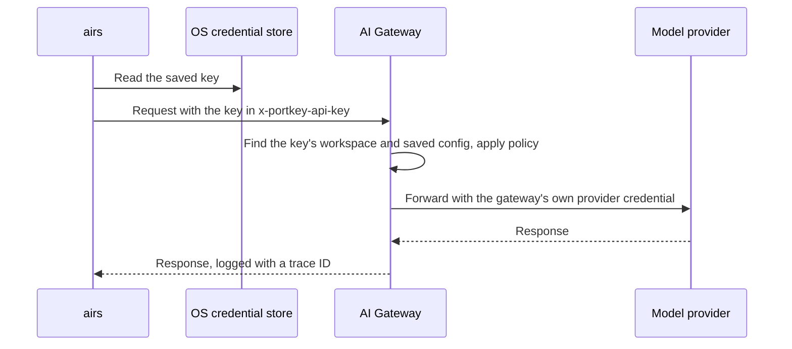

# Getting started with a workspace API key

By the end of this page you will have installed the harness, signed it into
Prisma AIRS AI Gateway with a workspace API key, proved the connection works, sent
your first request, and found that request in the gateway's observability console.
That is the smallest setup that shows the whole path working, from your terminal to
the gateway and back.

It uses a workspace API key because that has the fewest moving parts. There is no
identity provider to configure and no browser sign-in. You create one credential
in the gateway, paste it into the harness, and the workspace it belongs to decides
what you may do.

| Guide | Use it when |
| --- | --- |
| **Workspace API key** (this page) | You want the fewest moving parts, or this is your first setup. |
| [Company SSO](https://github.com/cdot65/prisma-airs-harness/blob/main/GETTING-STARTED-SSO.md) | Your administrator has set up Keycloak or Entra sign-in for the gateway. |
| [MCP servers with OAuth](https://github.com/cdot65/prisma-airs-harness/blob/main/GETTING-STARTED-MCP.md) | Inference works and you want to connect a remote tool server. |

The page has two parts. **Part 1** sets everything up. **Part 2** validates it one
layer at a time, showing the output you should see and what each line tells you,
so that when something breaks later you know where to look.

## How workspace key access works



The key is an opaque credential: it carries no claims of its own. The harness
sends it in the `x-portkey-api-key` header, and the gateway looks it up to find the
workspace it belongs to, the permissions you gave it and the saved config that
chooses the model. That is why everything about *what* a request may do is fixed
in Strata Cloud Manager, and everything about *whether the key arrives* is fixed on
your machine. Access checks also send their own trace ID in `x-portkey-trace-id`,
which is how you will match a check in your terminal to the same request in the
gateway logs. Ordinary session requests get a trace ID from the gateway instead.

## Before you start

You need three things.

- **A supported machine.** Apple Silicon, Linux x64 or Linux ARM64, with Node.js
  `^22.13.0 || >=23.5.0`. Windows and Intel Mac are not supported. Linux also
  needs a usable Bubblewrap sandbox and an unlocked Secret Service session, and
  macOS needs access to your Keychain. Both are where the harness stores your key.
- **Access to a gateway workspace.** Your administrator should have provisioned a
  model provider and a default saved config in it. A key gives you access, but it
  does not create a route to a model, so without that config your first request
  has nowhere to go.
- **The gateway address.** Your administrator provides it. The examples use
  `https://gateway.example.com`, which is not a live gateway.

Have Git and ripgrep installed as well, since the agent uses them when it works
with a project. You will start AIRS from a project directory, so open a terminal
in one.

## Part 1: Set up

### 1. Install the harness

Check Node first, in the terminal you will use:

```sh
node --version
```

If it prints a version older than the range above, install a supported version
using your organization's method, then reopen the terminal and check again.
Installing npm on Ubuntu does not upgrade a distro-provided Node 18.

Then install:

```sh
npm install -g airs-harness
```

The npm package is `airs-harness` and the command is `airs`. The Prisma AIRS CLI is
bundled, so you do not install a separate product CLI. If your organization
distributes through its own registry, add `--registry=<registry URL>`. You will
confirm the install in [step 5](#5-validate-the-install).

### 2. Create a workspace API key

You create this key in the gateway, not in the harness. In Strata Cloud Manager,
open **AI Security**, then **AI Gateway**, then **Security Keys**, and start a new
key. The [vendor configuration guide](https://docs.paloaltonetworks.com/ai-runtime-security/administration/configure-ai-gateway)
describes the console in more detail.

Make sure you are working in the gateway workspace your administrator gave you. A
key is bound to the workspace where it is created, and that workspace decides what
the key can do.

On the first page, **API Key Details**, fill in:

- **API Key Type:** User, which is a key for a specific user's access.
- **Select User:** yourself.
- **API Key Name:** anything that tells you what the key is for, such as
  `prisma airs harness`.
- **Configuration:** the saved config your administrator approved. This is what
  gives the key somewhere to send requests, because the config selects the provider
  and model. The screenshot shows one named `prisma-airs-openai-mlx`; yours will
  have a different name.
- **Allow Configuration Override:** set it the way your administrator specifies. It
  controls whether requests made with this key may choose a different saved config.
- **Controls & Limits:** add any rate limit your administrator requires.


Choose **Next: Set Permissions**. On the second page, select **Completions** with
**Write**. That is the inference permission, `completions.write`, and it is the only
one this guide needs. The screenshot also has **Mcp** with **Invoke** selected,
which you only need later for remote tools.


Choose **Create Gateway API Key**, then copy the key when it is shown. You will
paste it in the next step. Do not put it in a command argument, your shell history
or a chat message. A provider integration key or an AIRS scanner key is a
different credential and will not work here.

### 3. Check the gateway URL

Check the one value you will type before you type it. The gateway answers a health
request without any credential, so this proves the address, DNS and TLS are right:

```sh
curl -fsS https://gateway.example.com/v1/health
```

Any successful response, usually a short JSON body, means the address is right.
This is the same request `airs doctor` makes as its `gateway_health` check.

| You see | Meaning |
| --- | --- |
| A response, no error | The address works. Continue. |
| `Could not resolve host` | The host name is wrong, or your DNS cannot see it. |
| A certificate error | TLS interception or a private CA. Your administrator can tell you which CA to trust. |
| `Connection refused`, or no answer until a timeout | A firewall or proxy between you and the gateway. |
| `404` | The host is right but the path is not. Use the base address your administrator gave you. |

### 4. Connect AIRS and sign in

Create an environment, giving it a short name. An environment is only a local
profile: where to connect, which credential to use and where your conversation
history lives. The rest happens in prompts, so there are no setup flags to pass:

```sh
airs env create workspace-api
```

Running `airs` with no arguments on a fresh installation opens the same screens,
suggesting `work` as the name. Either way, answer them in order.

**Welcome to Prisma AIRS.** Choose **Connect an environment**.


**Environment name.** The name you typed is already filled in. Press Enter to keep
it, or change it.


**AI Gateway URL.** Enter the gateway address from your administrator, without
`/v1`. If the address you were given already includes a path, enter it exactly. AIRS adds the inference path when it saves the environment; you will see
the full address, ending in `/v1`, on the key prompt and in `airs env show`.


**Create this environment?** Check the name and address, then choose **Create
environment and sign in**. Nothing has been created until you do.


**Sign in to continue.** Choose **Use a workspace API key**. The other choice is
covered in the [company SSO guide](https://github.com/cdot65/prisma-airs-harness/blob/main/GETTING-STARTED-SSO.md).


Paste the key at the hidden prompt and press Enter. Nothing appears as you paste,
and Esc cancels.


The screen never asks you to pick a gateway workspace, because the key you created
in step 2 already belongs to one. That workspace decides what the key may do,
which is why its name does not need to match your environment's. The harness
stores the key in your operating system's credential store.

AIRS then checks the connection for you. **You're ready to use AIRS** means the
gateway accepted one real inference request made with your key. The screen shows
when the check ran and a trace ID for it, which you will find again in step 9. It
also says that MCP permissions were not tested, because remote tools have their own
sign-in.

If the check fails, the title is **Credential saved · gateway access needs
attention** instead, followed by **Your credential is saved**. The key is kept, so
do not enter it again. Choose **Exit and fix gateway access** and use the failure
table in [step 7](#7-validate-gateway-access) to read the reason.


Press Enter to continue. The next screen, **Optional: red-team judge**, offers a
TypeSafe key for red-team scoring. Choose **Continue to AIRS**. You can add that key later with
`airs env typesafe set`.


`airs env create` then returns you to the shell. Run `airs` to open a session in
the environment you just created. (Bare `airs` on a fresh installation goes
straight into the session.)

AIRS asks whether you trust the directory you started it in. Trusting it lets that
directory's own configuration, hooks and execution policies load, and untrusted
contents carry a higher risk of prompt injection. Choose **Yes, continue** for a
project you recognize.


The session opens with a header that confirms what you connected. It shows the
model route, which here is **AI Gateway — default**, meaning the gateway picks the
model according to your saved config. It also shows your directory, the
environment, the gateway address, the identity (a workspace credential) and the
permissions the agent has, which here let it write inside your working directory
and temporary folders.


From now on, running `airs` opens this environment. Setup is done. Exit the
session with Ctrl+C when you want to run the checks in Part 2 from the shell, or
keep it open in another terminal.

#### Set up from the shell instead

The screens above are the easiest path. For a script, or to add a second
environment, the same setup is three commands:

```sh
airs env create workspace-api --gateway-url https://gateway.example.com/v1
airs --environment workspace-api login --with-api-key
airs --environment workspace-api doctor --verify-access
```

- `env create` with `--gateway-url` saves and selects the environment without
  signing in. Here the URL includes `/v1`, because it is the inference API root.
- `login --with-api-key` shows the hidden `Workspace API key` prompt, stores the
  key and prints `Configured workspace credential for https://gateway.example.com/v1.
  No individual user identity is asserted.` A script can pipe the key on standard
  input instead: `airs --environment workspace-api login --with-api-key < key-file`.
- `doctor --verify-access` runs the access check the screens ran for you. Step 7
  explains its output.

## Part 2: Validate

Sign-in already proved one request works. These checks go one layer at a time,
from the install to the gateway's own logs, so you can see what each part of the
setup contributes. Steps 5 and 6 only read local state; step 7 sends one small
request.

### 5. Validate the install

```sh
airs --version
airs cli --version
```

Expected output, with your versions:

```text
airs 0.1.3
7.2.0
```

The first line is the harness. The second is the Prisma AIRS CLI bundled with it,
which you run as `airs cli`.

| If you see | Do this |
| --- | --- |
| `command not found: airs` | npm's global `bin` directory is not on your `PATH`. Run `npm prefix -g` and add its `bin` folder to `PATH`. |
| An error that the native package is unavailable | Reinstall with `npm install -g airs-harness --include=optional`. Your npm configuration omitted optional dependencies, which is where the native package lives. |
| A much older version | Another `airs` is earlier on your `PATH`. `type -a airs` lists every copy. |

### 6. Validate the environment

Three read-only commands show what the harness saved. None of them contacts the
gateway.

```sh
airs env list
```

```text
* workspace-api	https://gateway.example.com/v1
```

Each line is one environment and its gateway. The `*` marks the default, which is
the one `airs` opens when you do not name another.

```sh
airs env show
```

```json
{
  "name": "workspace-api",
  "id": "7a674da4-381b-4d8b-9ec7-8a1fe6b2b190",
  "gateway_url": "https://gateway.example.com/v1",
  "state_directory": "/home/alex/.airs-harness/environments/7a674da4-381b-4d8b-9ec7-8a1fe6b2b190"
}
```

`gateway_url` must end in `/v1`. `state_directory` is where this environment keeps
its configuration and conversations. It never contains the key.

```sh
airs login status
```

```text
Prisma AIRS Harness 0.1.3
State: /home/alex/.airs-harness/environments/7a674da4-381b-4d8b-9ec7-8a1fe6b2b190
Gateway: https://gateway.example.com/v1
Authentication: Workspace credential; saved OS-store binding 5c2e9f40-1b7a-4d3e-8f6c-0a9d2b4e7c13
Credential configuration: Saved; availability and gateway access not checked. Run airs doctor --verify-access to check access.
```

`Workspace credential; saved OS-store binding` means the key is in your Keychain
or keyring, referenced by that ID. `airs env status workspace-api` prints the same
report for a named environment. If you see `logged out; run airs login`, no key is
saved; sign in again with `airs login`.

Notice the last line. Everything so far describes what is saved on your machine.
Only a request can show the gateway accepts it.

### 7. Validate gateway access

In an open session, enter `/doctor` to open **Connection health** for the
environment you are using.


The top of the view offers three actions:

- **Refresh diagnostics** rereads your configuration and health. It sends no
  inference request.
- **Verify gateway access** sends one minimal inference request, with no
  conversation, files or tools. This is the real test of your connection.
- **Credential recovery** tells you how to replace a workspace key: exit and run
  `airs --environment NAME login`, which opens the same replace menu as
  `airs env auth NAME`.

Below the actions is a status line for each part of the connection. **Gateway
access** reads **Not verified** when you first open the view, because this view
has not run the check yet: a saved credential and a healthy response do not prove
that the gateway will accept a request. The other lines should read **OK**.

Choose **Verify gateway access**, then **Send connectivity check**. When it
succeeds, the **Gateway access** row reads **OK**, and its description says
*Gateway access verified by one inference response*. Your key, your workspace and
your route all worked for one real request.

The same check runs from the shell:

```sh
airs doctor --verify-access
```

```text
Checking gateway access with one minimal inference request (up to 16 output tokens). This sends only a fixed connectivity message, with no local files or tools. The request asks the provider not to store the response; gateway logging policy still applies.
Prisma AIRS Harness 0.1.3 — doctor
State: /home/alex/.airs-harness/environments/7a674da4-381b-4d8b-9ec7-8a1fe6b2b190
PASS credential_service: Credential service responded. Access to the saved credential is not verified; choose Verify gateway access.
PASS credential_cleanup: No pending credential cleanup
PASS local_tools: Required local executables found; this does not exercise kernel sandbox support
PASS configuration: https://gateway.example.com/v1
PASS capabilities: Local catalog readable; backend limits still apply
PASS gateway_health: HTTPS/HTTP health response successful; inference and policy not exercised
PASS mcp_configuration: 0 configured server(s); use /mcp and invoke a tool to verify remote authorization
PASS typesafe_judge: Not configured (optional). Set with airs env typesafe set
PASS gateway_access: Gateway access verified by one inference response. MCP permissions were not tested.
Checked at: 2026-09-30 14:02:11 UTC
Request / gateway trace ID: 0b6f2d8e-5c1a-4b7e-9d3f-2a61c4e8f901
```

This is macOS output; Linux adds a `linux_user_namespaces` line for its sandbox.
Every check runs on its own, so read the lines as layers: when one of the first
lines fails, fix it before looking at `gateway_access`.

| Line | What it proves |
| --- | --- |
| `credential_service` | Your Keychain or keyring answers. It does not read your key. |
| `local_tools` | Git and ripgrep are installed for the agent. |
| `configuration` | The environment is readable and points at this gateway. |
| `gateway_health` | The gateway answers over HTTPS. No credential was sent. |
| `gateway_access` | The gateway read your key, accepted one inference request with it, and a model answered. |

The request can use a little gateway quota and appears in the gateway logs.
Without `--verify-access`, `doctor` makes no inference request, so it is safe to
run any time. For scripts, `airs doctor --json` prints the same checks as JSON.

When any check fails, `doctor` exits with `Error: one or more AIRS Harness checks
failed`. The failing line contains one of these:

| Failing line says | Look at | Fix it in |
| --- | --- | --- |
| `credential_service: Credential service unavailable` | The Keychain, or the keyring and D-Bus session on Linux | Your machine |
| `gateway_health: Health probe failed` | The gateway address, DNS and TLS, as in step 3 | Your machine or network |
| `gateway_access: The gateway connection failed` or `reached its time limit` | Network path, proxy, DNS and TLS to the gateway | Your machine or network |
| `gateway_access: The saved credential could not be read` | The key in the credential store. Replace it with `airs env auth` | Your machine |
| `rejected authentication (HTTP 401)` | Whether the key is valid, unexpired and for this gateway | Strata Cloud Manager |
| `denied permission (HTTP 403)` | The key's `completions.write` permission, and whether the workspace grants access to the route | Strata Cloud Manager |
| `guardrail blocked this request (HTTP 446, policy denial)` | A gateway security policy. Some gateways report a block inside HTTP 200; AIRS reports that as a policy denial too. | Strata Cloud Manager |
| `rejected the probe (HTTP 404)` or another status, or `did not return a successful Responses API result` | The workspace's default saved config, its provider binding, the model and your quota | Strata Cloud Manager |

Give your administrator the trace ID from the failure, and never the key itself.

### 8. Send your first request

In the session, ask for something short and harmless. Here the prompt is
`hello world`. If you closed AIRS, run `airs` again to reopen it.


The answer should stream back. If it does, the whole path worked: your prompt went
through the harness to the gateway, the gateway applied its policy and forwarded
the request to the model provider using the provider credential it holds, and the
response came back the same way.

### 9. Find your request in the gateway logs

Now look at the other side of that request. In Strata Cloud Manager, open **AI
Security**, then **AI Gateway**, then **Observability**. Choose your workspace in
the workspace selector at the top, and open the **Logs** tab, next to Analytics and
Exports. Each row is one request, with its time and the model that served it. You
should see your prompt, and a little before it the check that ran during sign-in.
Times are shown in your console's time zone, while the harness shows UTC.

Select a row to open its details. The panel shows the trace ID, the model, the user,
the total cost and timing, the saved config and provider that handled it, and the
name of the API key that made the request. Below that are the guardrail results and
the full request and response. The request is far larger than the words you typed,
because it includes the harness's own instructions, so this is where you see exactly
what the gateway received.


Match the trace ID of the sign-in check to the one on the **You're ready to use
AIRS** screen, or to the one `doctor --verify-access` printed. They match because
the harness sends its own trace ID with the request and the gateway records it.
The log shows the saved config by its gateway ID, which is why it can look
different from the name you chose on the key. Seeing it here
confirms the gateway is recording your traffic. The harness only knows what came
back to your terminal; the gateway logs show what it received, what policy decided
and what it forwarded.

## Commands in this guide

| Command | What it does | Changes anything? | Sends a request? |
| --- | --- | --- | --- |
| `airs env create NAME` | Guided setup: name, gateway URL, sign-in | Creates the environment and saves the key | One access check |
| `airs env create NAME --gateway-url URL/v1` | Saves an environment without signing in | Creates the environment | No |
| `airs login --with-api-key` | Hidden prompt; stores the key in the OS credential store | Saves the key | No |
| `airs --version`, `airs cli --version` | Harness and bundled CLI versions | No | No |
| `airs env list` | Lists environments; `*` marks the default | No | No |
| `airs env show [NAME]` | Name, ID, gateway and state directory | No | No |
| `airs login status`, `airs env status [NAME]` | Gateway and how the credential is stored | No | No |
| `airs doctor` | Local checks and a gateway health probe | No | Health only, no credential |
| `airs doctor --verify-access` | All of the above, plus one inference request | No | Yes, up to 16 tokens |
| `/doctor` | The same checks inside a session | No | Only when you choose **Verify gateway access** |

Commands that act on an environment use the default one. Add `--environment NAME`
to run one command against another, for example
`airs --environment workspace-api doctor`.

## Replace, sign out and remove

| Task | Command |
| --- | --- |
| Replace the key, or switch this environment to company SSO | `airs env auth workspace-api` |
| Sign out and delete the stored key, keeping the environment and its history | `airs --environment workspace-api logout` |
| Unregister the environment (history stays on disk) | `airs env remove workspace-api` |

`env remove` does not delete the stored key, so sign out first when you retire an
environment.

`env auth` asks for confirmation, saves the new credential, removes the old one
from this machine and sends one access check. It stops open sessions in that
environment; resume them with `airs resume`. None of these commands revokes the
key at the gateway. When a key should stop working, revoke it in **Security Keys**.

## What to do next

You now have the working baseline, and everything more advanced builds on it.

- **Sign in as yourself** instead of with a key, in the
  [company SSO guide](https://github.com/cdot65/prisma-airs-harness/blob/main/GETTING-STARTED-SSO.md).
- **Connect a remote tool server**, such as a self-hosted MCP server published
  through the gateway, in [MCP servers with OAuth](https://github.com/cdot65/prisma-airs-harness/blob/main/GETTING-STARTED-MCP.md).
- **Keep separate accounts, destinations and histories** with more than one
  environment, in [Environments](https://cdot65.github.io/prisma-airs-harness/guides/environments/).
- **Look up a command** in the [command cheat sheet](https://cdot65.github.io/prisma-airs-harness/operations/cheat-sheet/).
- **Understand how a request is authorized and routed** in
  [Workspace, models and API keys](https://cdot65.github.io/prisma-airs-harness/configuration/gateway/).
