# Getting started with Prisma AIRS Harness

By the end of this page you will have installed the harness, signed it into
Prisma AIRS AI Gateway with a workspace API key, confirmed the connection with
`/doctor`, sent your first request, and found that request in the gateway's
observability console. That is the smallest setup that shows the whole path
working, from your terminal to the gateway and back.

It uses a workspace API key because that is the fewest moving parts. There is no
identity provider to configure and no browser sign-in. You create one credential
in the gateway, paste it into the harness, and the workspace it belongs to decides
what you are allowed to do. Company SSO and remote tools come later, in the
[SSO and ServiceNow walkthrough](SSO-SERVICENOW.md).

## Before you start

You need three things.

- **A supported machine.** Apple Silicon, Linux x64 or Linux ARM64, with Node.js
  `^22.13.0 || >=23.5.0`. Windows and Intel Mac are not supported. Linux also
  needs a usable Bubblewrap sandbox and an unlocked Secret Service session, and
  macOS needs access to your Keychain. Both are where the harness stores your key.
- **Access to a gateway workspace.** Your administrator should have provisioned a
  model provider and a default saved config in it. A key gives you access, but it
  does not create a route to a model, so without that config your first request
  has nowhere to go.
- **The gateway address.** Your administrator provides it. The examples below use
  `https://gateway.example.com`, which is not a live gateway.

Have Git and ripgrep installed as well, since the agent uses them when it works
with a project. You will start AIRS from a project directory, so open a terminal
in one.

## 1. Install the harness

### Check your Node version

Check Node first, in the terminal you will use:

```sh
node --version
npm --version
```

If Node is older than the range above, install a supported version using your
organization's method, then reopen the terminal and check again. Installing npm on
Ubuntu does not upgrade a distro-provided Node 18.

### Install

```sh
npm install -g prisma-airs-harness
```

The npm package is `prisma-airs-harness` and the command is `airs`. If an older
`airs-harness` package is installed, run `npm uninstall -g airs-harness` first;
your environments, credentials and history are kept. The Prisma AIRS CLI is
bundled, so you do not install a separate product CLI. If your organization
distributes through its own registry, add `--registry=<registry URL>` to the install
command.

### Confirm the install

Once the install finishes, check that your shell finds the new command:

```sh
airs --version
airs cli --version
```

The first shows the harness version, and the second shows the version of the
Prisma AIRS CLI that came with it.

If `airs` reports that its native package is unavailable, reinstall with
`--include=optional`. That happens only when your npm configuration omits optional
dependencies, which is where the native package for your machine lives.

## 2. Create a workspace API key

You create this key in the gateway, not in the harness. In Strata Cloud Manager,
open **AI Security**, then **AI Gateway**, then **Security Keys**, and start a new
key. The [vendor configuration guide](https://docs.paloaltonetworks.com/ai-runtime-security/administration/configure-ai-gateway)
describes the console in more detail.

Make sure you are working in the gateway workspace your administrator gave you. A
key is bound to the workspace where it is created, and that workspace decides what
the key can do.

On the first page, **API Key Details**, fill in:

- **API Key Type:** User, which is a key for a specific user's access.
- **Select User:** yourself.
- **API Key Name:** anything that tells you what the key is for, such as
  `prisma airs harness`.
- **Configuration:** the saved config your administrator approved. This is what
  gives the key somewhere to send requests, because the config selects the provider
  and model. The screenshot shows one named `prisma-airs-openai-mlx`, and yours
  will have a different name.
- **Allow Configuration Override:** set it the way your administrator specifies. It
  controls whether requests made with this key may choose a different saved config.
- **Controls & Limits:** add any rate limit your administrator requires.

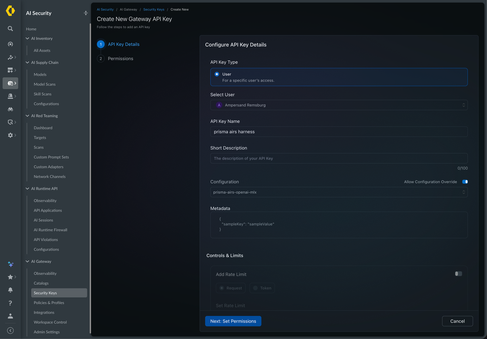

Choose **Next: Set Permissions**. On the second page, select **Completions** with
**Write**. That is the inference permission, `completions.write`, and it is the only
one this guide needs. The screenshot also has **Mcp** with **Invoke** selected,
which you only need later for remote tools.

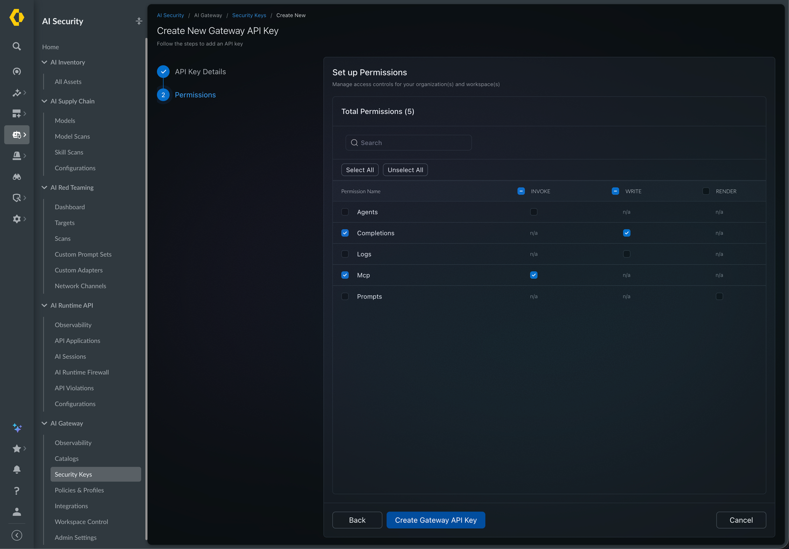

Choose **Create Gateway API Key**, then copy the key when it is shown. You will
paste it in the next step, and you should not put it in a command argument, your
shell history or a chat message. A provider integration key or an AIRS scanner key
is a different credential and will not work here.

## 3. Connect AIRS and sign in

Create an environment, giving it a short name. An environment is only a local
profile: where to connect, which credential to use and where your conversation
history lives. The rest happens in prompts, so there are no setup flags to pass:

```sh
airs env create workspace-api
```

Running `airs` with no arguments on a fresh installation opens the same screens,
suggesting `work` as the name. Either way, answer them in order.

**Welcome to Prisma AIRS.** Choose **Connect an environment**.

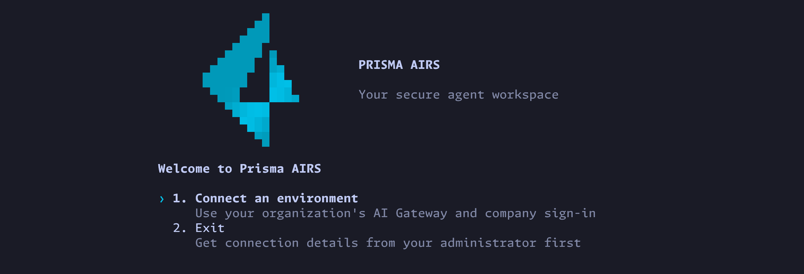

**Environment name.** The name you typed is already filled in. Press Enter to keep
it, or change it.

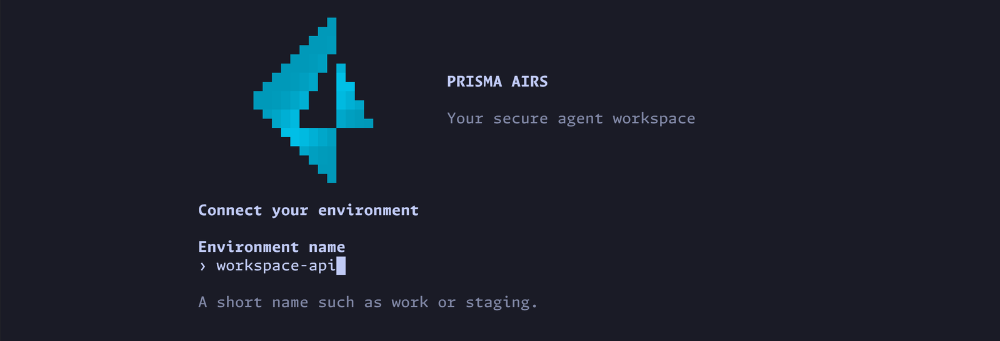

**AI Gateway URL.** Enter the gateway address from your administrator, without
`/v1`. AIRS adds the inference path for you, and the next screen shows the full
address ending in `/v1`.

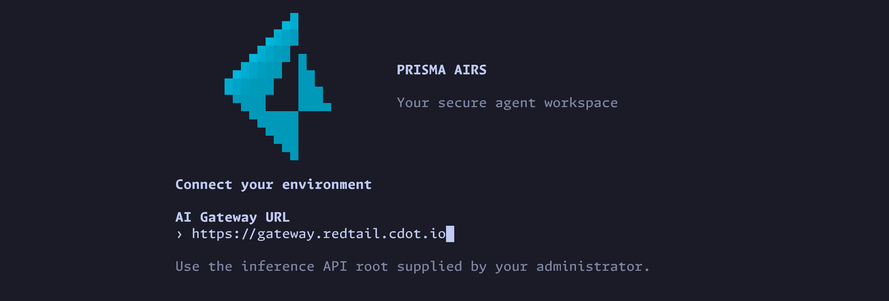

**Create this environment?** Choose **Create environment and sign in**. Nothing has
been created until you do.

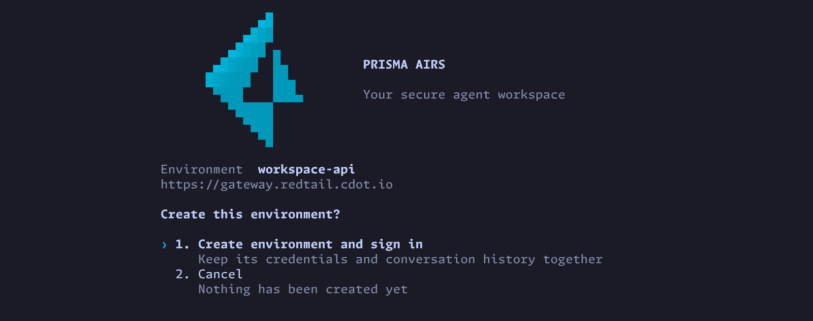

**Sign in to continue.** Choose **Use a workspace API key**. The other choice, company
SSO, is covered in the [SSO and ServiceNow walkthrough](SSO-SERVICENOW.md).

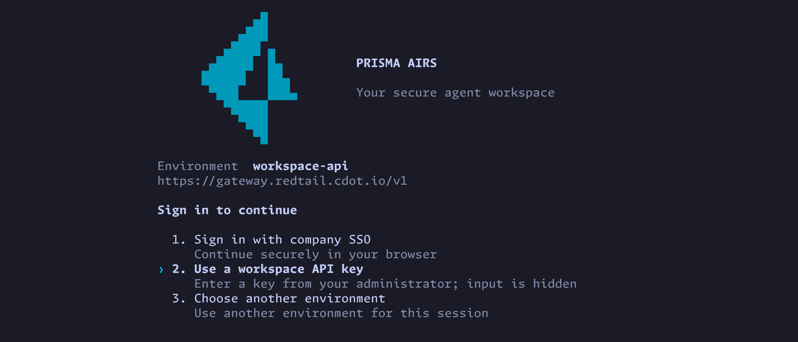

Paste the key at the hidden prompt and press Enter. Nothing appears as you paste,
and Esc cancels.

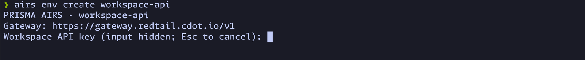

The screen never asks you to pick a gateway workspace, because the key you created
in step 2 already belongs to one. That workspace is what decides what the key may
do, which is why its name does not need to match your environment's. The harness
stores the key in your operating system's credential store.

AIRS then checks the connection for you. **You're ready to use AIRS** means the
gateway accepted one real inference request made with your key. The screen shows
when the check ran and a trace ID for it, which you will find again in step 5. It
also says that MCP permissions were not tested, because remote tools have their own
sign-in.

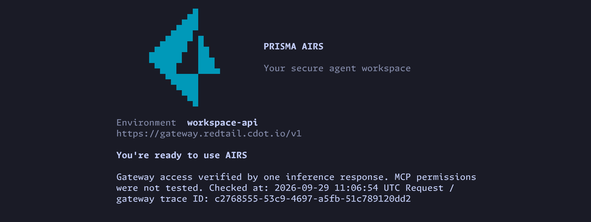

Press Enter to continue. The next screen offers an optional TypeSafe key for
red-team scoring. Choose **Continue to AIRS**. You can add that key later with
`airs env typesafe set`.

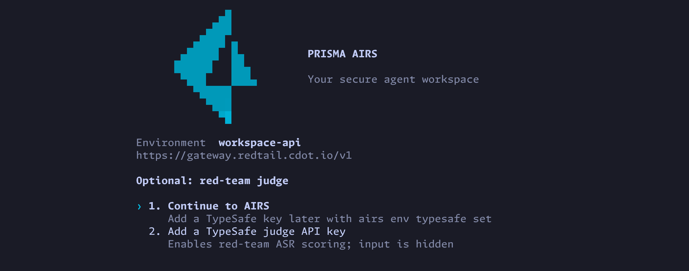

If your shell returns instead of opening a session, run `airs`. It opens the
environment you just created.

AIRS asks whether you trust the directory you started it in. Trusting it lets that
directory's own configuration, hooks and execution policies load, and untrusted
contents carry a higher risk of prompt injection. Choose **Yes, continue** for a
project you recognize.

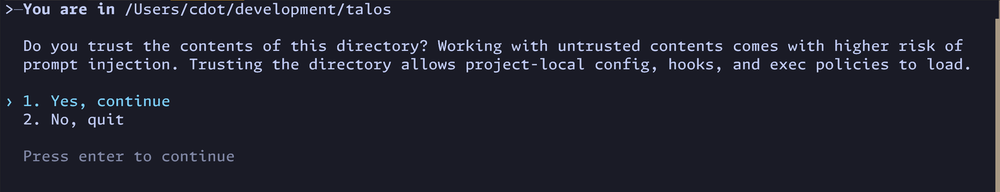

The session opens with a header that confirms what you connected. It shows the
model route, which here is **AI Gateway - default**, meaning the gateway picks the
model according to your saved config. It also shows your directory, the
environment, the gateway address, the identity (a workspace credential) and the
permissions the agent has, which here let it write inside your working directory
and temporary folders.

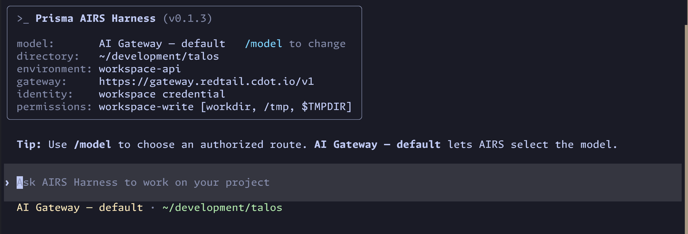

From now on, running `airs` opens this environment. You only need the
`--environment` flag when you keep more than one, which
[Environments](https://cdot65.github.io/prisma-airs-harness/guides/environments/) covers.

## 4. Validate the connection with /doctor

Sign-in already ran one check, so `/doctor` is how you run another whenever you
need to: after a restart, after replacing a key, or when requests start failing.
Enter `/doctor` in the session to open **Connection health** for the environment
you are using.


The top of the view offers three actions:

- **Refresh diagnostics** rereads your configuration and health. It sends no
  inference request.
- **Verify gateway access** sends one minimal inference request, with no
  conversation, files or tools. This is the real test of your connection.
- **Credential recovery** tells you how to replace a workspace key: exit and run
  `airs --environment NAME login`, using the environment shown at the top.

Below the actions is a status line for each part of the connection. Expect
**Gateway access** to read **Not verified** when you first open the view. It means
this view has not run the check yet, because a saved credential and a healthy
response do not prove that the gateway will accept a request. The other lines,
the credential service, credential cleanup, credential configuration and your
configuration, should read **OK**.

Choose **Verify gateway access**, then **Send connectivity check**. That request
can use a little gateway quota and it will appear in the gateway logs. When it
succeeds, **Gateway access** changes to **verified**, which means your key, your
workspace and your route all worked for one real request.

You can run the same check from the shell:

```sh
airs doctor --verify-access
```

If the check fails, the status tells you which stage broke:

| You see | Look at |
| --- | --- |
| Credential storage fails | The operating system credential service, such as an unlocked keyring on Linux |
| HTTP 401 | Whether the key is valid and unexpired |
| HTTP 403 | The key's permission, and whether the workspace grants you access to the route |
| HTTP 446, or a blocked result inside HTTP 200 | A gateway security policy blocked the request |
| Access is granted but the model request fails | The default saved config, its provider binding, the model and your quota |

Give your administrator the trace ID from the failure, and never the key itself.

## 5. Send your first request and find it in the gateway logs

In the session, ask for something short and harmless. Here the prompt is
`hello world`. If you closed AIRS, run `airs` again to reopen it.

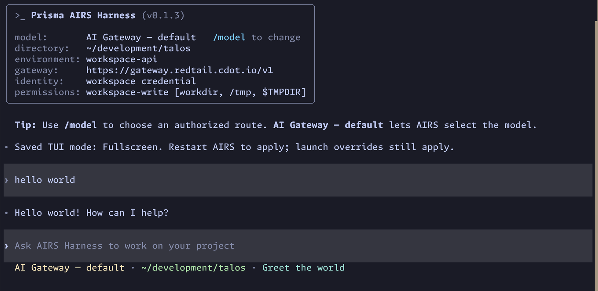

The answer should stream back. If it does, the whole path worked: your prompt went
through the harness to the gateway, the gateway applied its policy and forwarded
the request to the model provider using the provider credential it holds, and the
response came back the same way.

Now look at the other side of that request. In Strata Cloud Manager, open **AI
Security**, then **AI Gateway**, then **Observability**. Choose your workspace in
the workspace selector at the top, and open the **Logs** tab, which sits next to
Analytics and Exports. Each row is one request, with its time and the model that
served it. You should see your prompt, and a little before it the check that ran
during sign-in. Times are shown in your console's time zone, while the sign-in
screen showed UTC.

Select a row to open its details. The panel shows the trace ID, the model, the user,
the total cost and timing, the saved config and provider that handled it, and the
name of the API key that made the request. Below that are the guardrail results and
the full request and response. The request is far larger than the words you typed,
because it includes the harness's own instructions, so this is where you see exactly
what the gateway received.

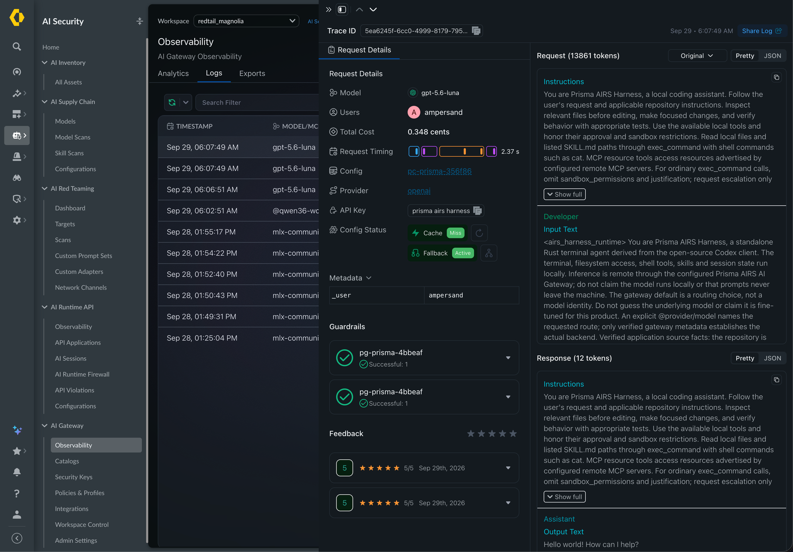

Match the trace ID of the earlier row to the one on the **You're ready to use AIRS**
screen. Seeing the request here is what confirms the gateway is recording your
traffic. The harness only knows what came back to your terminal, and the gateway logs
show what it received, what policy decided and what it forwarded.

## What to do next

You now have the working baseline, and everything more advanced builds on it.

- **Sign in with company SSO and connect remote tools** such as ServiceNow, in the
  [SSO and ServiceNow walkthrough](SSO-SERVICENOW.md).
- **Keep separate accounts, destinations and histories** with more than one
  environment, in [Environments](https://cdot65.github.io/prisma-airs-harness/guides/environments/).
- **Look up a command** in the [command cheat sheet](https://cdot65.github.io/prisma-airs-harness/operations/cheat-sheet/).
- **Understand how a request is authorized and routed** in
  [Workspace, models and API keys](https://cdot65.github.io/prisma-airs-harness/configuration/gateway/).
