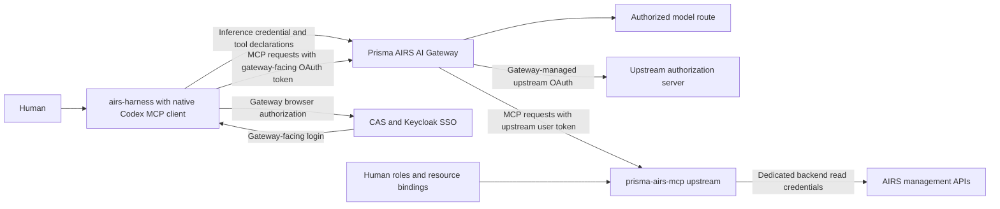

# Prisma AIRS MCP through AI Gateway

Both inference and remote MCP must target Prisma AIRS AI Gateway. The existing
Codex MCP client runs inside the normal `airs-harness` executable. The gateway
proxies upstream MCP servers and owns their upstream OAuth tokens. CAS/Keycloak
provides gateway-facing organizational login.

Alpha.13 is the published baseline and used a direct upstream route. That
onboarding is withdrawn. The correction targets **alpha.14**; installing
`airs-harness@latest` currently does not install this remediation. See
[GATEWAY_MCP_REMEDIATION.md](GATEWAY_MCP_REMEDIATION.md) for outstanding deployment
and live acceptance work.

## Onboarding prerequisites

Provision a gateway MCP integration scoped to the harness workspace, configure
its separate upstream OAuth client, and verify CAS/CIE identity and workspace
access. The native client must use the connection URL supplied by that gateway
integration. An upstream resource URL is not a valid substitute.

Keep the existing named inference environment. Once the alpha.14 candidate and
gateway integration are ready, add the verified gateway URL with native `mcp add`.
For example, using a fictional deployment:

```sh
airs-harness --environment work mcp add prisma-airs \
  --url https://mcp-gateway.example.com/workspace/prisma-airs/mcp
```

Native OAuth discovery handles gateway client registration and browser login.
Use gateway scopes supported by its discovery document. Do not supply the old
upstream Keycloak client ID, upstream read scopes or an upstream resource override
to this gateway-facing registration. The gateway requests `airs.gateway.read`
and `airs.profiles.read` separately using its own upstream client.

The intended human must have gateway workspace access and upstream resource
permissions. A shared SSO browser session does not make the tokens interchangeable.
The stock MCP client does not compare its identity with the inference identity.

Set `mcp_oauth_credentials_store = "keyring"` at the top level of the environment's
`config.toml` when file fallback is prohibited. macOS requires an unlocked login
Keychain; Linux requires an unlocked Secret Service session. Native `mcp login`,
`mcp list`, `/mcp` and `/mcp verbose` remain the connection controls.
`--no-browser` prints the authorization URL for manual opening; the browser still
needs access to the process's loopback callback port.

`mcp logout` removes the local gateway-facing credential. It does not sign out
inference or revoke gateway-managed upstream tokens and Keycloak sessions.

## Request path



The inference adapter flattens tool namespaces on the wire and restores them
before native dispatch. Canonical conversation history retains its namespaces.
Alpha.14 fixes inference history preservation when native MCP uses dynamic client
registration without an explicit OAuth client ID. Legacy helpers and explicit
static credentials remain pinned to their existing session binding.

## Release acceptance

The historical `scripts/validate_builtin_mcp.py` driver exercises the rejected
direct route. Its receipts cannot pass the new gateway promotion gate. A gateway
acceptance driver must observe native CAS login, gateway ingress, corresponding
upstream requests, all eight model-selected reads, authorization denials and both
OAuth lifecycles. Require the exact installed Linux and Apple Silicon candidates,
two expiry cycles, history preservation, npm upgrades and Mac signing evidence.
No alpha.14 gateway/CAS acceptance is claimed by source changes alone.

Use the normal npm registry update after an accepted release is published. An
older manual command symlink can shadow npm; inspect `command -v airs-harness`
and `npm prefix -g`. Follow the existing installation handover procedure only for
that known legacy layout. Preserve the inference environment and old executable.
