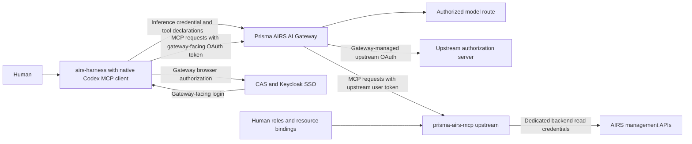

# Prisma AIRS MCP through AI Gateway

Both inference and remote MCP must target Prisma AIRS AI Gateway. The existing
Codex MCP client runs inside the normal `airs-harness` executable. The gateway
proxies upstream MCP servers and owns their upstream OAuth tokens. CAS/Keycloak
provides gateway-facing organizational login.

Alpha.14 is published with native gateway MCP support on Linux x64 and Apple
Silicon. Alpha.15 adds coordinated renewal and guided authentication recovery;
its installed-package production expiry checks are in progress. See
[PUBLICATION.md](PUBLICATION.md) for the published version and measured acceptance.

## Onboarding prerequisites

Provision a gateway MCP integration scoped to the harness workspace, configure
its separate upstream OAuth client, and verify CAS/CIE identity and workspace
access. The native client must use the connection URL supplied by that gateway
integration. An upstream resource URL is not a valid substitute.

Keep the existing named inference environment. Add the verified gateway URL
with native `mcp add` once your administrator has provisioned the integration.
For example, using a fictional deployment:

```sh
airs-harness --environment work mcp add prisma-airs \
  --url https://mcp-gateway.example.com/workspace/prisma-airs/mcp \
  --scopes mcp:servers:read,mcp:tools:list,mcp:tools:call
```

Native OAuth discovery handles gateway client registration and browser login.
Use gateway scopes supported by its discovery document. Do not supply the old
upstream Keycloak client ID, upstream read scopes or an upstream resource override
to this gateway-facing registration. The gateway requests `airs.gateway.read`
and `airs.profiles.read` separately using its own upstream client.

The intended human must have gateway workspace access and upstream resource
permissions. A shared SSO browser session does not make the tokens interchangeable.
The stock MCP client does not compare its identity with the inference identity.

Set `mcp_oauth_credentials_store = "keyring"` at the top level of the environment's
`config.toml` when file fallback is prohibited. macOS requires an unlocked login
Keychain; Linux requires an unlocked Secret Service session. Native `mcp login`,
`mcp list`, `/mcp` and `/mcp verbose` remain the connection controls.
`--no-browser` prints the authorization URL for manual opening; the browser still
needs access to the process's loopback callback port.

`mcp logout` removes the local gateway-facing credential. It does not sign out
inference or revoke gateway-managed upstream tokens and Keycloak sessions.

## Request path



The inference adapter flattens tool namespaces on the wire and restores them
before native dispatch. Canonical conversation history retains its namespaces.
Alpha.14 fixes inference history preservation when native MCP uses dynamic client
registration without an explicit OAuth client ID. Legacy helpers and explicit
static credentials remain pinned to their existing session binding.

## Release acceptance

`scripts/validate_gateway_mcp.py` drives native interactive SSO and tool checks.
The promotion gate requires the exact installed Linux and Apple Silicon packages,
two real frontend expiry cycles, history preservation, npm upgrades and Mac
signing evidence. Separately collected gateway/CAS/upstream observations bind
the route, client and run window. Each run needs a unique MCP server name because
the OS-user keyring is shared across isolated harness homes.

Parallel runs using the same browser also share a Keycloak client session.
Revoking one inference refresh token removes that client session and interrupts
the other run. Supply a distinct `--cleanup-barrier` directory to each peer.
After every peer has written `ready.json`, the controller writes `release.json`
containing only that peer's `nonce`. A failed peer must wait too. The runner
performs native logout after release; an unreleased barrier fails acceptance and
still cleans up after three hours. Keep the controller active until both peers
finish cleanup. Credential metadata is collected even if a post-expiry tool call
fails; it never substitutes for successful tool results.

Run `scripts/coordinate_gateway_cleanup.py --local /linux/run/cleanup --remote
/mac/run/cleanup --ssh-host user@mac` alongside both validators, using those
paths for their respective `--cleanup-barrier` arguments. Add `--identity-file`
when desktop SSH needs a file key instead of an agent.

Use the normal npm registry update after an accepted release is published. An
older manual command symlink can shadow npm; inspect `command -v airs-harness`
and `npm prefix -g`. Follow the existing installation handover procedure only for
that known legacy layout. Preserve the inference environment and old executable.


The interactive runner takes an exact native executable, a new isolated state
folder, the gateway and upstream URLs, an output receipt and a
`--gateway-evidence` JSON file. On Linux, run it under `dbus-run-session` and use
`--browser-via-ssh cdot@desktop-host` when the browser is on an SSH-reachable Mac;
it forwards only the native loopback callback and terminates that tunnel afterward.
The human completes the browser login; no password is collected by the runner.

The observations file must bind `endpoint`, `upstream_endpoint`,
`binary_sha256` and `started_at` to the printed run window. Its `results` must
contain the gateway/CAS cases in the promotion contract, plus
`gateway_native_refresh_observed`, each with a measured `evidence` reference.
Preserve timestamped, redacted request/correlation evidence separately. A success
boolean with no observation is insufficient.

The inspected gateway 2.22.0 issues one-hour opaque MCP access tokens. The runner
therefore waits two real one-hour expiry intervals for `--refresh-cycles 2`;
upstream Keycloak tokens expire separately after five minutes. A zero-cycle smoke
run is incomplete and cannot pass the standard lifecycle promotion gate. Both
exact installed alpha.14 packages passed production native login, credential
storage and all eight tools with gateway/upstream correlation. For alpha.14 the
owner explicitly authorized publication without another hourly test. The
exception records zero completed frontend expiry cycles and preserves the failed
idle-session receipts. See [PUBLICATION.md](PUBLICATION.md).


## Active sessions and idle reauthentication

The deployed Keycloak realm has a 30-minute SSO idle timeout. Observed upstream
refresh grants expire after 30 minutes without renewal, even though a
gateway-facing MCP access token lasts an hour. A valid frontend token alone
does not ensure that the gateway can renew an expired upstream grant. Prolonged
inactivity can require fresh inference and MCP login.

The release driver tests active use across two real gateway expiries. It performs
authorized reads every ten minutes while outside the final pre-expiry quiet
window. Each read must leave the frontend token and expiry unchanged. Fresh
concurrent processes then run after the actual one-hour expiry. This tests
renewal under normal activity; it does not claim an hour of idle SSO continuity.
The earlier silent-wait runs are failed receipts, not release acceptance.
