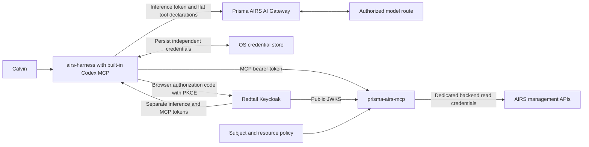
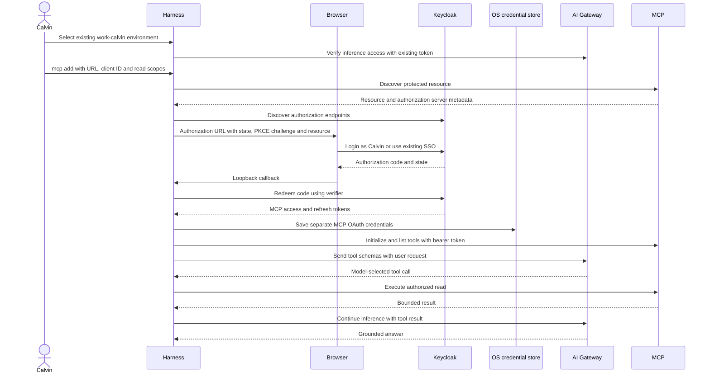

# Read-only Prisma AIRS MCP

The harness uses its existing Codex Streamable HTTP MCP client and browser OAuth
flow. The AI Gateway carries inference and model tool declarations. MCP requests
travel directly from the harness to the authenticated MCP resource server.

## Connect an existing environment

Update the normal command through the owned registry:

```sh
npm install -g airs-harness@latest --registry=https://npm.cdot.io
airs-harness --version
```

If this host still has a manually installed `airs-harness` symlink outside npm,
use `--force` for this one-time handover. npm replaces the command link and leaves
its old target executable intact. Subsequent npm-managed updates need neither
`--force` nor an uninstall. Use the same npm prefix that is on your PATH; inspect
`command -v airs-harness` and `npm prefix -g` if an older command still wins.

Keep the existing `work-calvin` inference environment. Add the server there:

```sh
airs-harness --environment work-calvin mcp add prisma-airs \
  --url https://prisma-airs-mcp.cdot.io/mcp \
  --oauth-client-id prisma-airs-harness-mcp \
  --scopes airs.gateway.read,airs.profiles.read
```

Sign in as `calvin` (`calvin@cdot.io`) in Redtail. Protected-resource discovery
provides the resource indicator. Do not also supply `--oauth-resource`: this
registration otherwise receives duplicate resource parameters. Explicit scopes
avoid requesting unrelated realm permissions.

For native-storage-only behavior set `mcp_oauth_credentials_store = "keyring"`
at the top level of this environment's `config.toml`. The upstream `auto` mode
may fall back to a file if the OS store is unavailable. macOS requires an unlocked
login Keychain; Linux requires an unlocked Secret Service session.

```sh
airs-harness --environment work-calvin mcp list
airs-harness --environment work-calvin doctor --verify-access
airs-harness --environment work-calvin
```

In the interactive harness, `/mcp` should show `prisma-airs`. Ask it to list the
AIRS workspaces, gateway configurations, guardrails and security profiles. These
are eight bounded read-only tools; the server enforces roles, scopes and explicit
subject-to-workspace/profile permissions on every request.

To repeat MCP login, use `mcp login prisma-airs --scopes
airs.gateway.read,airs.profiles.read` with the same environment selection.
`--no-browser` on `mcp add` or `mcp login` prints the URL for manual opening; a
remote browser still needs access to the process's loopback callback port.
`mcp logout prisma-airs` removes only local MCP OAuth credentials. It does not
revoke Keycloak sessions or sign out inference.

## Architecture



The gateway adapter flattens tool namespaces only on the inference wire copy,
then restores them before existing MCP dispatch. Canonical history retains its
namespaces. Adding native OAuth MCP configuration preserves the inference
session binding; legacy helper/static credential configurations remain pinned.

Inference and MCP are separate logins. The native MCP client does not compare
an MCP ID token with the inference identity. Use Calvin for both browser flows;
the MCP server authorizes the subject in its access token.



## Release acceptance

`scripts/validate_builtin_mcp.py` drives the normal executable through real
browser PKCE with a disposable authorized account, all eight model-selected
reads, history preservation, concurrent post-expiry calls and separate logout.
`scripts/validate_airs_npm_upgrade.py` exercises ordinary npm updates and the
one-time legacy link handover while hashing preserved configuration and native
bytes. Public receipts contain no tokens, authorization URLs or user passwords.
