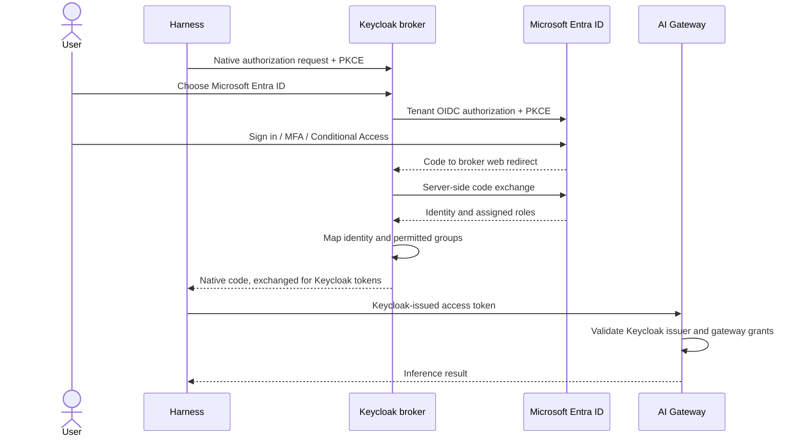

Use Entra as an upstream OIDC identity provider for Keycloak. The harness still
uses the Keycloak issuer, native client, audience and gateway claim contract from
[Keycloak setup](keycloak.md). Entra's application secret stays on the server;
it never belongs in the harness.

## 1. Register the broker application

In the intended Entra tenant, register a single-tenant application such as
`Example Corp Keycloak`. Add a **Web** redirect URI, exactly:

```text
https://sso.example.com/realms/example-corp/broker/entra/endpoint
```

This confidential web application is separate from Keycloak's public native
`ai-gateway-agent` client. Record the tenant ID and application client ID. Create
a time-limited client secret and place it in the server-side secret store used
by your Keycloak deployment. Record the expiration and rotation owner. Do not
save it in a realm export, Git, terminal history or a public documentation example.

Set **Assignment required** on the enterprise application. Assign an approved
test user or group. Where the tenant requires it, grant administrator consent
for the delegated OIDC permissions before testing. The reference deployment
requests `openid profile email` and optional ID-token claims `email`,
`given_name`, and `family_name`.

Create application roles if access is managed in Entra, for example
`Inference.Invoke` and `Tools.Read`, and assign them to the appropriate groups.
These are examples; the Keycloak mapping in the next step must use the exact
role values you configured.

## 2. Add the identity provider to Keycloak

Under realm **Identity providers**, add OpenID Connect v1.0 with alias `entra`.
Use the tenant-specific discovery URL:

```text
https://login.microsoftonline.com/YOUR_TENANT_ID/v2.0/.well-known/openid-configuration
```

Use the Entra application client ID and server-held secret. The deployed pattern
uses client authentication `client_secret_post`, PKCE `S256`, default scopes
`openid profile email`, sync mode `FORCE`, and **Trust email off**. Retain the
standard first-broker-login flow with account verification. Do not automatically
link an existing account just because the email addresses match.

Permit Keycloak egress to `login.microsoftonline.com:443` and keep external DNS,
TLS and time synchronization working. Check discovery's authorization, token,
and JWKS endpoints against the selected tenant. A browser reaching Entra does
not prove that Keycloak can exchange the code from inside the cluster.

Leave Entra as an explicit login choice until tested. Local Keycloak users can
remain available according to your recovery policy; changing the default login
provider is a separate operational decision.

## 3. Map identity and grants

Use a username template such as `${CLAIM.preferred_username | lowercase}` and
map the broker's email/name claims according to your organization's policy.
Retain Entra `oid` and `tid` as server-side attributes when needed for stable
identity correlation. Do not use a display name as an authorization identifier.

Map Entra application role `Inference.Invoke` to Keycloak group
`/stacks/ai-inference/production/users`. That group's resource-client role
`invoke` reaches the inference access token through the mapper configured in
[Keycloak setup](keycloak.md). Map `Tools.Read` separately to the group your
MCP/CAS authorization policy expects; an inference group alone is insufficient.

With forced synchronization, role/group mappings are reevaluated on a broker
login. Removing an Entra assignment does not instantly invalidate an existing
Keycloak session or issued token. Test removal at the next login and follow your
session/token revocation procedure when immediate access removal is required.

## 4. Validate the complete login



Run the normal harness login and choose Entra in the browser. Confirm the final
issuer is Keycloak, the audience is `stack-ai-inference`, the client is
`ai-gateway-agent`, the workspace is correct and the `invoke` grant is present.
Inspect claims only in a private local tool; do not paste a live token into an
online decoder. Run `airs --environment work doctor --verify-access`, then the
separate MCP read-only check in [acceptance](../validation/acceptance.md).

The reference deployment has recorded credential-free redirect validation to
the Entra sign-in page. That evidence does **not** establish a completed human
Entra login, post-broker token claims, or a live MCP operation. Record those
outcomes for your own assigned account before calling the federation accepted.

| Symptom | Check |
| --- | --- |
| Redirect URI mismatch | Web redirect path, realm and identity-provider alias |
| User not assigned | Enterprise application assignment and app role |
| Consent required | Tenant administrator consent policy |
| Browser login succeeds, broker fails | Keycloak egress, client secret and expiration, tenant endpoints |
| Login succeeds, inference denied | Keycloak group mapping, role scope and gateway claim contract |
| Old access persists after role removal | Existing Keycloak sessions, token lifetime and revocation |

Microsoft documents the [Web redirect registration](https://learn.microsoft.com/en-us/entra/identity-platform/how-to-add-redirect-uri) and [OIDC protocol](https://learn.microsoft.com/en-us/entra/identity-platform/v2-protocols-oidc) used by the broker.
