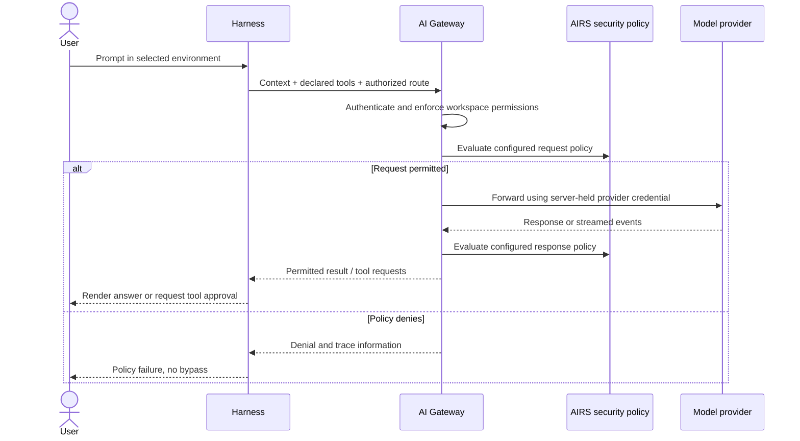

An environment selects a local gateway profile. A workspace owns gateway-side
provider access, routes, credentials, limits and policy. Create the workspace and
route before enrolling the first harness user.

## Configuration inventory

| Value | Where it comes from | Where it is used |
| --- | --- | --- |
| Organization UUID | Gateway organization | OIDC `portkey_oid` mapping |
| Workspace UUID | Gateway management resource | Administrative API operations |
| Workspace slug | Gateway workspace | OIDC `portkey_workspace` and workspace binding |
| Saved-config slug | Approved model config | OIDC `defaults.config_slug` or workspace-key default |
| Resource audience | Keycloak resource client | Login audience and gateway JWT validation |
| Inference URL | Deployed gateway listener | Local environment `--gateway-url` |
| MCP URL | Published gateway integration | Native MCP connection |

Do not reuse example values as real IDs. The self-standing example calls the
workspace `agent-production`, but you must copy its generated slug and resource
identifiers from your own deployment.

## Provision a usable default

Provision the provider into this workspace, select a model supported by that
integration, and save a default configuration. Attach the required AIRS scanning
and identity policies to the route. Give the intended user `completions.write`
and any workspace membership required by your deployment.

For SSO, map the workspace and saved config into the token as described in
[Keycloak setup](keycloak.md). For a workspace key, attach the approved default
config to that key. Authentication alone does not provision a provider or create
a route. Keep config override disabled for ordinary users unless an explicit
policy permits selecting another saved route.

## Workspace API-key inference

In the gateway's workspace API-key management, create a **user workspace key**
with inference permission, expiration and limits. Copy it once into the hidden
harness prompt:

```sh
airs env create workspace-api --gateway-url https://gateway.example.com/v1
airs --environment workspace-api login --with-api-key
airs --environment workspace-api doctor --verify-access
```

Skip environment creation if the profile exists. A successful save establishes
local credential storage; the doctor probe establishes one authorized inference
request. Never pass a key as a command argument or paste it into an agent prompt.
A key does not create an OIDC session and does not sign in MCP.

A JWT-only policy cannot accept an opaque key. Your gateway must explicitly
support both credential paths in the relevant policy configuration, or place
them in separately bound workspaces/routes. Test both permitted and denied cases
for each method rather than bypassing the identity guardrail.

## Model routing in the terminal

Use `/model` to inspect the choices exposed for the current environment. The
**gateway default** uses the administrator's saved routing policy. An explicit
model or saved-config selection must be permitted by that policy. A visible
choice is not proof that the provider has capacity or that the user can invoke it.



Local files and tool results can become inference context. The local sandbox and
approval policy control execution on the user machine; gateway policy controls
routed requests and responses. Keep both enabled.

## Diagnose by stage

| Observation | Investigate |
| --- | --- |
| Credential storage fails | Native OS credential service |
| HTTP 401 | Key validity or JWT signature/issuer/expiry |
| HTTP 403 | Role, scope, workspace and route authorization |
| HTTP 446 or a blocking hook in HTTP 200 | Gateway security-policy denial |
| Auth succeeds, model request fails | Default saved config, provider binding, model and quota |
| Inference works, tools fail | Separate MCP authentication and upstream permissions |

Share a trace ID and sanitized diagnostic report with the administrator. Do not
share raw credentials, authorization callbacks or unreviewed debug output.
