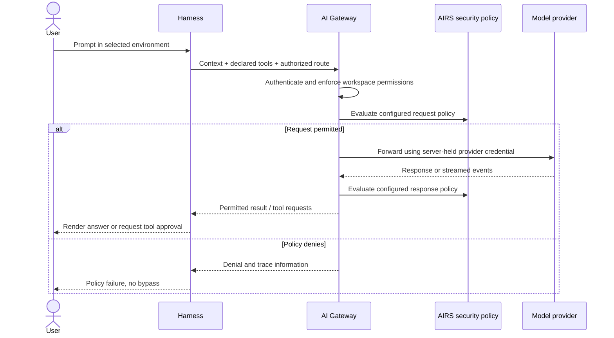

This page has two parts. The first explains how a request is authorized and
routed, so the setup choices make sense. The second is the procedure: gather the
identifiers, provision a default route, enroll users by SSO or by workspace key,
and check the result.

## How requests are authorized and routed

A working setup has two halves. On the user's machine, an environment selects a
local gateway profile. On the gateway, a workspace owns provider access, routes,
credentials, limits and policy. The environment only points at the gateway;
everything that decides whether a request is allowed lives in the workspace.

That is why the workspace and route come first. Signing in proves who the person
is, but without a route there is nowhere for their request to go. A token or key
identifies the caller; it does not provision a provider or create a route.



There are two control points in that flow, and neither covers the other's half.
The local sandbox and approval policy decide what runs on the user's machine.
Gateway policy decides which requests and responses get through. Local files and
tool results can become inference context, so the gateway may see content that
originated locally, but it has no say over what a command does on the machine
itself. Keep both enabled.

**Two ways to authenticate.** A person can sign in with company SSO, which gives
the harness a signed JWT, or use a user workspace key, which is an opaque
credential. They reach the same route but are validated differently. A JWT-only
policy validates a signed token's issuer, audience and claims, and an opaque key
carries none of those, so that policy rejects it. To support both, the gateway
must explicitly allow both credential paths in the relevant policy
configuration, or place them in separately bound workspaces or routes.

**What `/model` shows.** The gateway default uses the administrator's saved
routing policy. An explicit model or saved-config selection must be permitted by
that policy. A visible choice is not proof that the provider has capacity or that
the user can invoke it, because the list shows what is offered, and the gateway
decides at request time.

## Set it up

### 1. Gather the identifiers

| Value | Where it comes from | Where it is used |
| --- | --- | --- |
| Organization UUID | Gateway organization | OIDC `portkey_oid` mapping |
| Workspace UUID | Gateway management resource | Administrative API operations |
| Workspace slug | Gateway workspace | OIDC `portkey_workspace` and workspace binding |
| Saved-config slug | Approved model config | OIDC `defaults.config_slug` or workspace-key default |
| Resource audience | Keycloak resource client | Login audience and gateway JWT validation |
| Inference URL | Deployed gateway listener | Local environment `--gateway-url` |
| MCP URL | Published gateway integration | Native MCP connection |

Do not reuse example values as real IDs. The example calls the workspace
`agent-production`; copy the generated slug and resource identifiers from your
own deployment.

### 2. Provision a usable default

Create the workspace and route before enrolling the first harness user.
Provision the provider into this workspace, select a model supported by that
integration, and save a default configuration. Attach the required AIRS scanning
and identity policies to the route. Give the intended user `completions.write`
and any workspace membership required by your deployment.

For SSO, map the workspace and saved config into the token as described in
[Keycloak setup](keycloak.md). For a workspace key, attach the approved default
config to that key. Keep config override disabled for ordinary users unless an
explicit policy permits selecting another saved route.

### 3. Enroll a user with a workspace key

In the gateway's workspace API-key management, create a **user workspace key**
with inference permission, expiration and limits. Copy it once into the hidden
harness prompt:

```sh
airs env create workspace-api --gateway-url https://gateway.example.com/v1
airs --environment workspace-api login --with-api-key
airs --environment workspace-api doctor --verify-access
```

Skip environment creation if the profile exists. Never pass a key as a command
argument or paste it into an agent prompt. The last two commands prove different
things. A successful save proves the key is in local credential storage. The
doctor probe proves the gateway accepted one inference request with it. A key
does not create an OIDC session and does not sign in MCP.

Test both permitted and denied cases for each authentication method rather than
bypassing the identity guardrail.

### 4. Check the routes a user can see

In the terminal, use `/model` to inspect the choices exposed for the current
environment. Confirm the gateway default resolves to the route you provisioned.

## Diagnose by stage

Each observation below points at a specific stage of the flow, which narrows
where to look.

| Observation | Investigate |
| --- | --- |
| Credential storage fails | Native OS credential service |
| HTTP 401 | Key validity or JWT signature/issuer/expiry |
| HTTP 403 | Role, scope, workspace and route authorization |
| HTTP 446 or a blocking hook in HTTP 200 | Gateway security-policy denial |
| Auth succeeds, model request fails | Default saved config, provider binding, model and quota |
| Inference works, tools fail | Separate MCP authentication and upstream permissions |

Share a trace ID and sanitized diagnostic report with the administrator. Do not
share raw credentials, authorization callbacks or unreviewed debug output.
