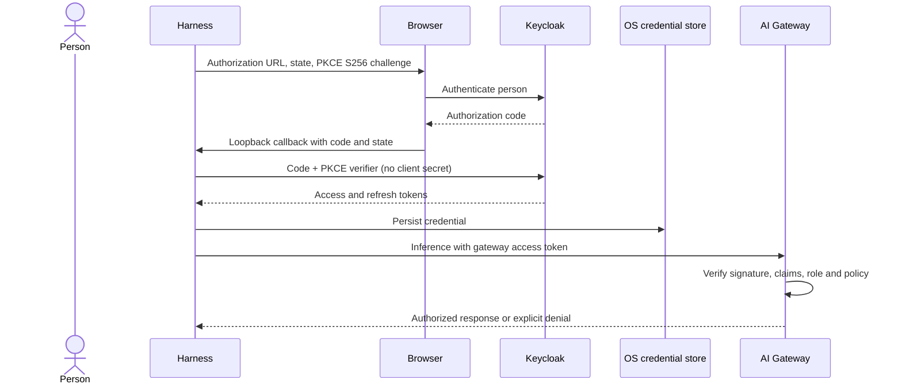

This guide reproduces the deployed identity design with sanitized names. The
harness is a **public native OIDC client**. Keycloak authenticates the person;
AI Gateway validates the resulting access token and enforces access to a model
route. Signing in and being authorized to invoke a model are separate checks.

Complete [platform deployment](../platform/deployment.md) first. Keep a Keycloak
administrator session available and use a test user before assigning production
groups. The examples use Keycloak realm `example-corp`, user `alex`, native client
`ai-gateway-agent`, and resource client `stack-ai-inference`.

## 1. Establish the realm

Use an externally reachable HTTPS issuer:
`https://sso.example.com/realms/example-corp`. Its discovery document is
`https://sso.example.com/realms/example-corp/.well-known/openid-configuration`.
The harness and gateway must reach the issuer; the gateway must reach its JWKS
endpoint. Configure the public hostname and reverse-proxy forwarding consistently
so discovery never advertises an internal cluster address.

The reference realm uses a 15-minute access-token lifespan, a 30-minute SSO idle
timeout, a 10-hour SSO maximum, refresh-token revocation enabled and maximum reuse
zero. These are example operational settings, not a requirement to weaken your
organization's policy. Keep clocks synchronized. Refresh recovery belongs in
[operations](../operations/cheat-sheet.md), not in a longer-lived static token.

## 2. Create the resource role and group

In the Keycloak admin console, select the realm and create an OpenID Connect
resource client named `stack-ai-inference`. This client names the audience and
owns the client role `invoke`; it is not a second interactive harness login.
Disable interactive flows and service accounts that this resource client does
not use.

Create its client role `invoke`. Create group
`/stacks/ai-inference/production/users` and map that client role to the group.
Add test user `alex` to the group only after the negative authorization check
in [validation](../validation/acceptance.md). Ordinary realm membership must not
automatically grant model access. Also enroll the person in the gateway workspace
using its supported membership workflow. The deployed gateway checks that
membership separately; the `invoke` role and a workspace claim alone do not
create it. Use the same email/identity mapping as the gateway member record.

## 3. Create the installed-application client

Create OpenID Connect client `ai-gateway-agent` with these settings:

| Setting | Value |
| --- | --- |
| Client authentication | Off (public client; no secret) |
| Standard flow | On |
| PKCE challenge method | `S256` |
| Implicit flow | Off |
| Direct access grants | Off |
| Service accounts | Off |
| Device authorization grant | On if attended SSH sign-in is needed |
| Valid redirect URI | `http://127.0.0.1/callback` |
| Web origins | Empty |
| Full scope allowed | Off |

The harness binds a loopback listener on an available port. Keycloak's native
loopback redirect handling allows that dynamic port with this registered path;
do not substitute a broad wildcard callback. Keep the host `127.0.0.1` and path
`/callback` consistent. Device authorization is an alternative flow enabled by
the issuer; it is not a password grant.

## 4. Attach the token contract

Create a dedicated OIDC client scope `agent-inference`. Attach it as a **default**
scope to `ai-gateway-agent`, alongside `basic`, `profile`, `email`, `roles`, and
an OIDC scope named `completions.write`. Set `completions.write` to appear in the
token's scope claim. The reference scope needs no claim mappers of its own.

Add the following protocol mappers to `agent-inference`. Enable access-token
inclusion. Values beginning with `YOUR_` must come from your gateway workspace;
they are not values to paste unchanged.

| Mapper | Token claim | Value / source | Type |
| --- | --- | --- | --- |
| Audience | `aud` | Custom audience `stack-ai-inference` | Audience |
| Hardcoded claim | `portkey_oid` | `YOUR_ORGANIZATION_UUID` | String |
| Hardcoded claim | `portkey_workspace` | `YOUR_WORKSPACE_SLUG` | String |
| Hardcoded claim | `defaults.config_slug` | `YOUR_SAVED_CONFIG_SLUG` | String |
| Hardcoded claim | `defaults.allow_config_override` | `false` | boolean |
| Hardcoded claim | `defaults.metadata.environment` | `production` | String |
| Hardcoded claim | `defaults.metadata.tier` | `agent-user` | String |
| User property | `defaults.metadata._user` | User property `email` | String |
| User client role | `harness_inference_roles` | Roles of `stack-ai-inference` | String, multivalued |
| User attribute, optional | `defaults.metadata.budget_tier` | `harness_budget_tier` | String |

The `portkey_*` names are the gateway's wire contract; keep them even though
all example organization names are sanitized. A dotted mapper name produces a
nested JSON object when configured as a normal Keycloak claim mapper. For the
role mapper, leave the role prefix empty and map actual user roles; never
hardcode `invoke` into every user's token.

In the native client's scope mappings, explicitly allow the resource client's
`invoke` role. With full scope disabled, both the user's grant and the client's
scope mapping are needed. Verify the effective token, not just the admin form.

The deployed design also has an optional `agent-runtime-defaults` scope for
administrator-managed user attributes: `gw_config_slug` → `defaults.config_slug`,
`gw_email` → `email`, `gw_allow_config_override` →
`defaults.allow_config_override` (boolean), and `gw_rate_limits` → `rate_limits`
(JSON). Start without these overrides. Do not attach two competing mappers for
the same claim until you have tested precedence and the missing-attribute case.
Never let ordinary users edit authorization, route, or limit attributes.

## 5. Enforce the contract at AI Gateway

Configure JWT validation in the gateway policy for this SSO route:

| Check | Expected value |
| --- | --- |
| Credential header | `x-portkey-api-key` |
| Signature algorithm | `RS256` |
| JWKS | `https://sso.example.com/realms/example-corp/protocol/openid-connect/certs` |
| Issuer | `https://sso.example.com/realms/example-corp` |
| Audience | `stack-ai-inference` |
| Authorized party (`azp`) | `ai-gateway-agent` |
| Scope | Contains the complete word `completions.write` |
| Workspace | Exact authorized workspace slug |
| Inference roles | Includes the granted `invoke` role |
| Required standard claims | `sub`, `iat`, `exp`, `aud`, `iss` |
| Required application claims | `azp`, `scope`, `portkey_workspace`, `harness_inference_roles` |

The reference guardrail uses `default.jwt`, `clockTolerance: 5`,
`maxTokenAge: "15m"`, `failOnError: true`, and a synchronous deny action.
Its scope expression is `(^| )completions\.write( |$)` and its single-role
contract checks `^invoke$`. If you grant additional roles, test the guardrail's
array matching behavior explicitly before changing that contract. Apply the
policy to both chat completion and Responses request types used by your routes.

Decoding a JWT is not validation. Reject invalid signatures, wrong issuer,
audience or client, expired tokens, missing permission and the wrong workspace.
A saved config must also select a provisioned provider/model and the required
AIRS security policy. See [gateway configuration](gateway.md).

An unconditional JWT guardrail rejects opaque workspace API keys. Use a gateway
configuration that explicitly supports each credential method, or separate
policy bindings/workspaces; do not disable JWT checks to make a key work.

## 6. Sign in from the harness

```sh
airs env create work --gateway-url https://gateway.example.com/v1
airs --environment work login \
  --issuer-url https://sso.example.com/realms/example-corp \
  --oidc-client-id ai-gateway-agent \
  --audience stack-ai-inference
airs --environment work doctor --verify-access
```

Skip creation when `work` exists. Enter the user's password only on the identity
provider's browser page. Use `--device-auth` with the same login settings for an
issuer-enabled device flow. Native credential storage must succeed before the
sign-in is usable. The doctor probe makes a small inference request and can
consume quota.



Continue with [Entra federation](entra.md) if needed, then run the complete
[acceptance workflow](../validation/acceptance.md). Inference login does not
sign in the gateway MCP connection.

See the [Keycloak native OIDC guide](https://www.keycloak.org/securing-apps/oidc-layers) for loopback redirect behavior.
