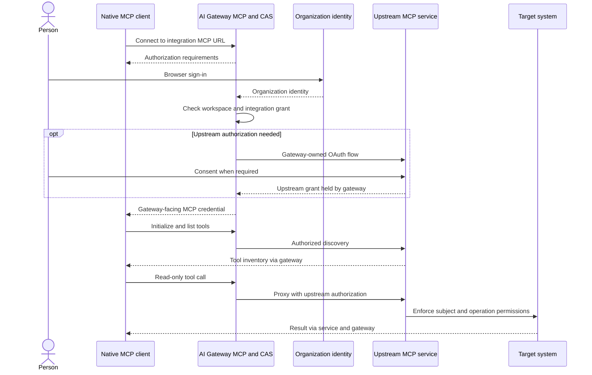

This page has two parts. The first explains how a tool call is authorized, so a
failure points you at the right layer. The second is the procedure: the
administrator's setup, the user's connection, the test that proves it works, and
how to renew or retire it.

## How tool access works

If you have already set up inference sign-in, MCP will look familiar, but it is a
separate connection with its own credential and its own grants. Nothing from the
inference login carries over.

The harness's built-in MCP client connects to the AI Gateway MCP listener. The
gateway authenticates the user through CAS/organizational SSO, authorizes the
workspace integration, and owns OAuth to the upstream MCP service. That means
three separate checks can each fail on their own: gateway login, tool discovery,
and authorization of the actual tool operation. Knowing which one failed tells
you where to look.



**Where each credential lives.** The harness holds only a gateway-facing MCP
credential. The upstream grant stays with the gateway, and the backend credential
stays with the upstream service. That is why the harness never connects to the
upstream MCP URL directly: doing so would skip the gateway's workspace and
integration checks instead of fixing whatever failed.

**Why the inference token does not work here.** MCP uses its own audience and
credential flow. Holding `completions.write` says a person may run inference; it
says nothing about tool access.

**Why the tool call is the evidence.** A model can produce a plausible answer
without calling anything, so a connected label or a well-formed reply does not
show that the path works. The transcript's tool call and its returned result do.
Likewise, a test that only ever succeeds does not show that the grant is doing
anything, so the procedure includes a user without the grant.

**Why a new conversation.** The tool inventory belongs to the connection that
produced it. When the connection or identity changes, the harness does not insert
a changed inventory into the previous conversation. It starts a new one and
preserves the old conversation and any unsent draft.

## Set it up

### 1. Administrator setup

Deploy the upstream tool service and configure its backend credential with the
minimum required permissions. Register the gateway's confidential OAuth client
with that upstream service and configure the exact callback and scopes required
by the gateway integration. Store that client secret on the server.

Publish the integration into the intended gateway workspace. Configure the
listener's organizational SSO/CAS policy and the user/group grants. Use a separate
MCP resource audience and credential flow as required by that service; do not
reuse the inference token or assume `completions.write` grants tool access.

For the sanitized incident-service example, grant user `alex` a subject binding
that permits `list_incidents` and `get_incident`. Keep creation and modification
outside the read-only group. Provide the integration's full gateway URL, such as
`https://gateway-mcp.example.com/tools-dev/mcp`.

### 2. Connect as a user

Open `airs`, enter `/mcp`, and select **Add gateway MCP server**.
Use local name `incident-tools` and the administrator-provided gateway URL.
Complete organizational sign-in and any gateway-managed upstream consent. On
SSH, open the displayed link on your browser device, then paste the entire final
callback URL only into the manager's hidden field. The browser's localhost page
may fail because the harness is on the remote host; the manual callback field
completes this flow.

Wait for credential persistence and tool discovery. Choose **Start new
conversation** after a connection or identity change.

To add the connection from the shell instead of the in-session manager:

```sh
airs mcp add incident-tools \
  --url https://gateway-mcp.example.com/tools-dev/mcp \
  --scopes mcp:servers:read,mcp:tools:list,mcp:tools:call
# Use only if the add flow did not finish login:
airs mcp login incident-tools --no-browser
```

Scopes must match the gateway's published authorization contract. The example
scope list is for a gateway exposing these permissions, not a universal upstream
MCP convention. Device authorization support is independent of inference SSO.

### 3. Prove a tool call

Ask the agent to list up to five active incidents using `incident-tools`, without
creating or updating records. Inspect the transcript for the actual
`list_incidents` call and returned result. An authorized empty list is valid.

Restart and repeat the read-only call to test persisted credentials. Then test a
user without the tool grant and confirm denial. Retain gateway trace IDs and
sanitized result status, not incident bodies or authorization tokens.

## Renew and retire

Use `/mcp` → **Reconnect and verify** for current discovery, and **Sign in** for
renewal. Inference `/signin` and `airs logout` do not replace MCP login/logout.
Sign out a connection before removing it when retiring local credentials; revoke
the gateway's upstream grant separately when it must no longer be usable.
