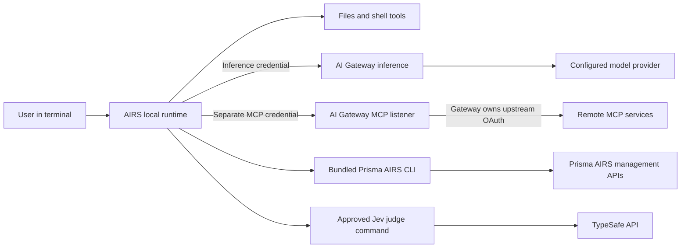

This page explains how the harness is built and where each piece runs. It does
not walk you through installing or operating anything. For that, see the
[operating guides](#operate-the-harness) at the end.

## What runs where

The harness is a standalone Rust terminal agent derived from Codex. Its local
runtime owns conversation history, files, shell execution, skills, sandboxing
and approvals. The npm launcher selects the native package for the host and
supplies the bundled Prisma AIRS CLI for product administration.

Remote tools are declared to the model through inference, then executed through
the native MCP connection. The management CLI does not implement that
connection.

## Identity boundaries

Each path from the harness to a remote service in the diagram carries its own
credential, and none of them stands in for another.

| Path | Credential | Who decides |
| --- | --- | --- |
| Inference | Company SSO or a workspace API key | AI Gateway |
| Remote tools | A separate MCP credential from CAS/company SSO | AI Gateway policy and the upstream service |
| Product administration | A CLI tenant's management credentials | Prisma AIRS management APIs |
| Jev judge | An optional TypeSafe key, used by an approved command | TypeSafe |

The built-in native MCP client authorizes the gateway listener separately from
inference. Signing in for one does not sign in for another, so a working
inference login says nothing about tool access.

Environment names describe local profiles. Gateway workspaces, saved configs,
provider integrations and entitlements live in the control plane. Product CLI
tenants and optional TypeSafe credentials are separate from both inference and
MCP login.

## Data and execution

Source files stay on the local machine, but selected contents and tool results
can be included in inference context. Two controls apply, and neither covers the
other's half. Tool approvals govern local execution. Gateway guardrails govern
routed requests and responses.

A gateway denial cannot be repaired by bypassing it with a direct upstream
connection. The denial is the policy doing its job; going around it removes the
control rather than fixing the request.

## Operate the harness

This page describes the design. To do something with it, use these instead:

| Task | Guide |
| --- | --- |
| Install, connect and sign in | [Getting started](../generated/getting-started.md) |
| Set up the gateway, identity and tool access | [Workspace and keys](../configuration/gateway.md), [Keycloak](../configuration/keycloak.md) and [MCP](../configuration/mcp.md) |
| Deploy the platform around the harness | [Deploy the gateway platform](../platform/deployment.md) |
| Look up a command | [Command cheat sheet](../operations/cheat-sheet.md) |
| Confirm a deployment works | [Acceptance validation](../validation/acceptance.md) |

## For contributors

The implementation entrypoint is `codex-rs/cli/src/airs_main.rs`, with environment,
login, doctor and credential helpers in the same directory. Terminal interaction
lives under `codex-rs/tui`; skills under `codex-rs/skills`. The npm launcher and
managed CLI resolver live under `npm/airs-harness`. Build and test instructions
are in [Build and contribute](development.md).

For the wider infrastructure and identity curriculum, see the separate
[reference architecture](https://cdot65.github.io/prisma-airs-reference-architecture/).
