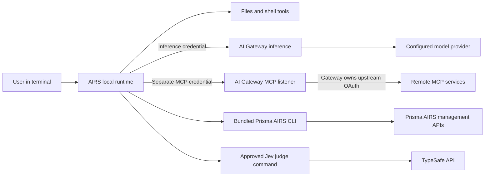

The harness is a standalone Rust terminal agent derived from Codex. Its local
runtime owns conversation history, files, shell execution, skills, sandboxing
and approvals. The npm launcher selects the native package for the host and
supplies a pinned Prisma AIRS CLI for product administration.

## Identity boundaries

Company SSO or a workspace API key authorizes inference. The built-in native MCP
client separately authorizes the gateway listener; CAS/company SSO and gateway
policy control access. Remote tools are declared to the model through inference,
then executed through the native MCP connection. The management CLI does not
implement that connection.

Environment names describe local profiles. Gateway workspaces, saved configs,
provider integrations and entitlements live in the control plane. Product CLI
tenants and optional TypeSafe credentials are separate from both inference and
MCP login.

## Data and execution

Source files stay on the local machine, but selected contents and tool results
can be included in inference context. Tool approvals govern local execution;
gateway guardrails govern routed requests and responses. A gateway denial cannot
be repaired by bypassing it with a direct upstream connection.

The implementation entrypoint is `codex-rs/cli/src/airs_main.rs`, with environment,
login, doctor and credential helpers in the same directory. Terminal interaction
lives under `codex-rs/tui`; skills under `codex-rs/skills`. The npm launcher and
managed CLI resolver live under `npm/airs-harness`.

For the wider infrastructure and identity curriculum, see the separate
[reference architecture](https://cdot65.github.io/prisma-airs-reference-architecture/).
