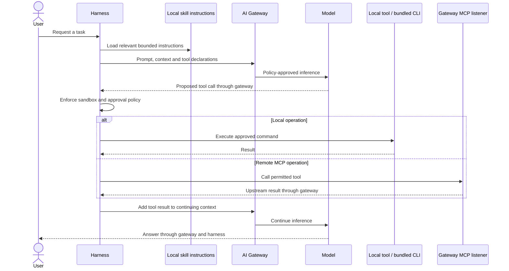

Skills provide task instructions to the local agent. The harness bundles Prisma
AIRS product skills with the pinned CLI and an optional TypeSafe Jev judge skill.
A skill does not grant a credential or bypass the local approval policy.

The bundled product CLI calls Prisma AIRS management APIs using its own tenant
credentials. Those administrative API calls are distinct from the agent's model
inference and remote MCP traffic. Use an explicit tenant, begin with read-only
inspection, and review writes before approving them.

The optional Jev judge sends selected scan records to TypeSafe using a separate
native-stored key and an approved command. It is an explicit specialized service
integration, not an alternate route for the agent's model conversation. Dry-run
and replay modes let you inspect the workflow before live scoring. Follow the
[judge guide](judge.md) for the actual commands and output contract.

TypeSafe supplies typed judgments and probabilities; code controls execution,
thresholds and reporting. Evaluate the resulting decisions on representative
records. A typed answer is not proof that a semantic security assessment is true.
See [TypeSafe's System One model](https://docs.typesafe.ai/concepts/system-one)
for that distinction.

Files remain in the local workspace until a command or selected context sends
their contents elsewhere. Tool output may enter the next model request. Keep
secrets out of skill text, command arguments and transcripts, and use the
harness's native credential prompts for supported credentials.
