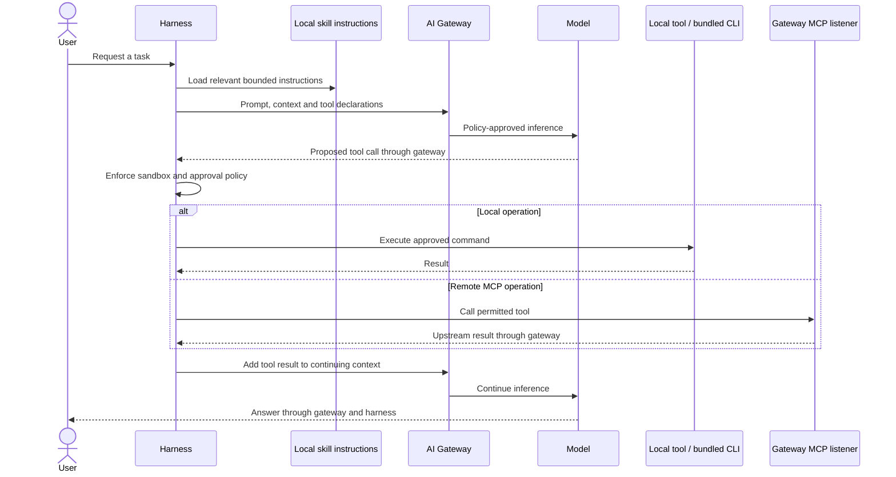

This page has two parts. The first explains what a skill is and how one moves
through the agent loop. The second is practical: how to use skills safely,
including the bundled CLI and the optional judge.

## How skills and the agent loop work

Skills provide task instructions to the local agent. The harness bundles Prisma
AIRS product skills with the bundled CLI and an optional TypeSafe Jev judge skill.
A skill does not grant a credential or bypass the local approval policy. It
changes what the agent tries to do, not what it is allowed to do.

The model proposes a tool call, but the harness decides whether it runs. The
sandbox and approval policy sit between the proposal and the action, and the
result goes back into the conversation as context for the next model request.

**Three separate traffic paths.** The bundled product CLI calls Prisma AIRS
management APIs using its own tenant credentials. Those administrative calls are
distinct from the agent's model inference and from remote MCP traffic, and none of
the three credentials stands in for another.

**The judge is a specialized integration.** The optional Jev judge sends selected
scan records to TypeSafe using a separate native-stored key and an approved
command. It is not an alternate route for the agent's model conversation.
TypeSafe supplies typed judgments and probabilities; code controls execution,
thresholds and reporting. A typed answer is not proof that a semantic security
assessment is true. See
[TypeSafe's System One model](https://docs.typesafe.ai/concepts/system-one) for
that distinction.

**Where your data goes.** Files remain in the local workspace until a command or
selected context sends their contents elsewhere. Tool output may enter the next
model request, which is why the loop above matters for what you approve.

## Use skills

### Invoke and find skills

Invoke a skill with `$name`. Local skills live in `.agents/skills/<name>/SKILL.md`
or the selected environment's skills directory. The managed product CLI and
embedded skills are described in
[Provision a workspace with the bundled CLI](../generated/bundled-cli.md).

### Work safely with the product CLI

Use an explicit tenant, begin with read-only inspection, and review writes before
approving them.

### Run the judge

Dry-run and replay modes let you inspect the workflow before live scoring. Follow
the [judge guide](judge.md) for the actual commands and output contract, and
evaluate the resulting decisions on representative records.

### Keep secrets out

Keep secrets out of skill text, command arguments and transcripts, and use the
harness's native credential prompts for supported credentials. Anything in a
transcript can become context for a later request.
