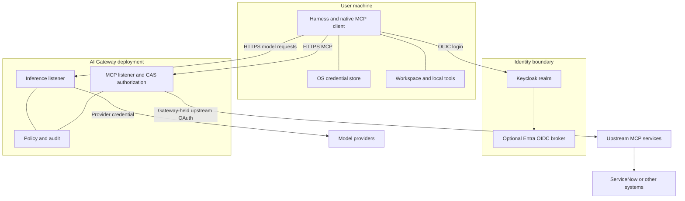

This page has two parts. The first explains how the platform around the harness
fits together, so you know what you are building and why it is ordered this way.
The second is the procedure: the deployment order and the checks between
components.

## How the platform fits together

The harness runs on each user's machine. It connects to an existing licensed
Prisma AIRS AI Gateway deployment; installing the npm package does not deploy a
gateway, identity provider, model integration or MCP service. Use your supported
gateway release and deployment package for the infrastructure installation.



**Six components, each with an owner.** Knowing who owns each piece tells you who
to ask when a stage fails.

| Component | Sanitized endpoint | Owner / responsibility |
| --- | --- | --- |
| Keycloak | `https://sso.example.com` | Identity team: realm, clients, groups, federation |
| Inference data plane | `https://gateway.example.com/v1` | Gateway team: auth, models, policy and audit |
| MCP listener | `https://gateway-mcp.example.com/tools-dev/mcp` | Gateway team: CAS login and upstream OAuth |
| Upstream MCP service | Private integration endpoint | Service team: tool implementation and target-system permissions |
| Model provider | Provisioned gateway integration | Platform team: credentials, capacity and routing |
| Management plane | Tenant-specific SCM / gateway management APIs | Administrators: workspaces, integrations and policy |

**Different endpoints, different identifiers.** The management API endpoint is not
the inference `/v1` URL. A workspace UUID, workspace slug and SCM resource scope
name are also different identifiers. Record each under its actual name so a pasted
UUID does not silently replace a slug.

**Who must reach whom.** The user host must reach the inference listener, MCP
listener and identity provider. The gateway must reach Keycloak discovery and
JWKS, its configured model providers and upstream MCP services. Keycloak needs its
database and, for Entra federation, outbound HTTPS to Microsoft's tenant
endpoints. Upstream tool services need access to only their intended backend
systems.

**Why streaming needs care.** Inference responses arrive as server-sent events. A
buffering proxy holds the stream back, so the user sees nothing and then the whole
response at once. Treat streaming and MCP calls as long-lived connections, not as
short web page requests.

**Why the stages stay separable.** Identity, inference route and MCP integration
are provisioned and tested one at a time. That way a broker failure does not
obscure a gateway authorization problem.

**What never goes in the harness.** Cluster distribution, ingress class, storage
driver and vendor image credentials are deployment-specific. They do not belong in
the harness's local `config.toml`. Likewise, the harness never connects directly
to an upstream service as a fallback, because that would skip the gateway's
authorization and policy entirely.

## Deploy it

### 1. Establish infrastructure prerequisites

Provision stable DNS, TLS certificates and clock synchronization, and confirm the
reachability described above. Keep database and administrative endpoints private.

Preserve streaming HTTP connections through ingress, proxies and load balancers,
and avoid proxy buffering that delays server-sent inference events. Set timeouts
for the gateway's supported streaming and MCP transport. Install the
organization's CA where each client validates TLS; do not use an insecure TLS
bypass to get a health check passing.

Deploy Keycloak with persistent database storage, stable public hostname, backups
and monitored health. Deploy the vendor-provided gateway components and confirm
their readiness before provisioning users.

### 2. Provision one inference route

Create a dedicated gateway workspace such as `agent-production`. Provision a
provider integration and model that supports the harness's selected protocol.
Create a saved config with that provider/model and the required security policy.
Record the workspace slug and saved-config slug.

For product administration, configure the bundled CLI's tenant. It is separate
from anything the harness uses for inference:

```sh
airs cli tenant create platform-admin
airs cli --tenant platform-admin doctor
airs cli --tenant platform-admin aigateway --help
```

The first command prompts for SCM tenant service group, OAuth client ID and a
hidden client secret. It does not sign the harness into inference. Use the
management console or the [resource provisioning commands](../operations/cheat-sheet.md#provision-gateway-resources)
to create a workspace and bind provider/MCP integrations. The CLI's admin-plane
and data-plane endpoints are management settings; do not substitute the deployed
inference listener for them.

Follow [gateway configuration](../configuration/gateway.md) to bind the workspace,
default route, permissions and guardrails before testing a user login.

### 3. Provision identity

Follow [Keycloak setup](../configuration/keycloak.md) for the public native client,
audience, claims, group-to-role grant and gateway JWT validator. Add
[Entra federation](../configuration/entra.md) only after local Keycloak sign-in
works.

For key-based inference, provision a user workspace key and policy that explicitly
supports that method. A provider key, AIRS scanner key or SCM client secret is
not a workspace inference key.

### 4. Provision a gateway MCP integration

Publish the upstream MCP service behind the gateway integration. Configure the
gateway's confidential upstream OAuth client, allowed callback, requested scopes
and credential storage on the server. Bind the integration to the intended
gateway workspace and configure CAS/organizational SSO for the listener.

For a ServiceNow example, the backend service holds its integration credential
and enforces the user's subject binding and incident permissions. Start with
`list_incidents` and `get_incident`; provision create/update rights separately.
Record the complete gateway integration URL ending in `/mcp` for users.

Validate upstream OAuth independently, then gateway authorization, discovery and
one read-only tool call. See [MCP configuration](../configuration/mcp.md).

### 5. Prepare and enroll a user machine

Install the harness using [getting started](../generated/getting-started.md).
The supported distribution platforms are Apple Silicon, Linux x64 and Linux ARM64.
Provide Git, ripgrep and the project's tools. Linux needs a usable Bubblewrap
sandbox and an unlocked Secret Service session; macOS needs access to the user's
Keychain. Use the [Ubuntu preparation guide](../generated/ubuntu.md) for an SSH host.

Give the user the public issuer, client ID, audience, inference URL and MCP URL.
Keep passwords, client secrets and provider credentials out of that handoff.
Run the [acceptance checklist](../validation/acceptance.md) before enrolling the
next group. Retain status, versions, timestamps and trace IDs, not live tokens.

## Operate and recover

Monitor gateway errors by trace ID, Keycloak login/refresh failures, upstream
OAuth expiry, provider quota and backend tool authorization. Test Keycloak and
gateway backups as separate recovery procedures. Rotate Entra and upstream MCP
client secrets on the server, workspace keys in the gateway, and renew local
credentials with the harness login commands. A docs deployment or npm upgrade
does not rotate any of those identities.

For the separate procedure that publishes this site and the native packages,
see [release deployment](../guides/deployment.md).
