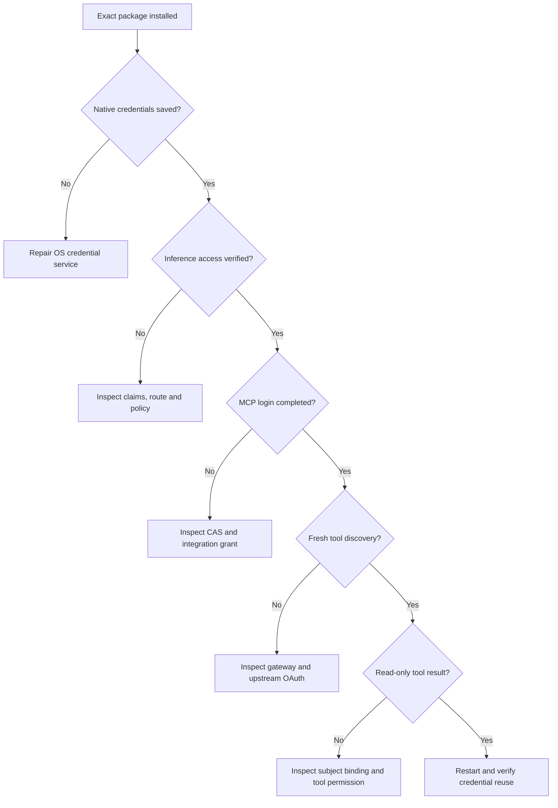

This page has two parts. The first explains how acceptance is structured and what
each kind of evidence proves, so you know what a pass means. The second is the
procedure: the checks to run, in order, and what to record.

## How acceptance works

Run this sequence against the exact installed version and selected environment.
A successful browser callback, a saved token, a healthy process and a successful
business operation establish different things. Recording them separately means a
later failure points at the stage that broke instead of at the whole chain.

**The stages depend on each other.** Each check assumes the one before it passed.
When one fails, the flowchart shows which part of the system to inspect, and
stops you from debugging a later stage before an earlier one is sound.



**Not every pass proves the same thing.** Distinguish what each kind of evidence
covers:

| Evidence | What it proves |
| --- | --- |
| Unit/fixture tests | Behavior under controlled inputs |
| Exact installed native-package tests | Distribution, storage and tested runtime behavior on that host |
| Disposable user against live gateway | Real identity and gateway policy for that fixture |
| Human Entra login and live tool call | That person's complete federated and upstream access |
| Browser documentation checks | Site routes, diagrams, navigation and layout |

Do not promote a planned step or a prior release's receipt to a new successful
result. The [release notes](../guides/releases.md) describe recorded release
checks and any remaining live-account limits.

**Why the negative tests matter.** Denials show the controls do something. A test
that only ever succeeds does not show that a grant, role or policy is doing any
work. That is why the procedure starts from a denial and tests a user without the
grant.

**Why the gateway stays in the path.** Substituting a direct provider endpoint or
a direct upstream MCP URL tests the provider or the upstream service, not the
deployment you are accepting.

## Run the checks

### 1. Verify the installed distribution

```sh
node --version
npm --version
type -a airs airs-cli airs-harness
airs --version
airs cli --version
airs --migration-check
```

Confirm the intended release and bundled CLI, the supported host architecture,
and the executable that your shell resolves. Reopen the terminal after changing
Node or the executable path. An ARM64 binary tested under QEMU is not proof of
native ARM64 installation, credential storage or sandbox behavior.

### 2. Check infrastructure and identity discovery

```sh
curl --fail --silent --show-error \
  https://sso.example.com/realms/example-corp/.well-known/openid-configuration
```

Confirm the exact external issuer and HTTPS authorization/token/JWKS endpoints.
Check TLS trust, DNS and clock synchronization from both the user host and the
gateway. Use the gateway's supported readiness check for its deployed version;
an unauthenticated `GET /v1` is not a universal health endpoint.

Inspect the native client configuration against [Keycloak setup](../configuration/keycloak.md).
Verify the loopback redirect, S256 requirement, role scope mapping and default
client scopes. Inspect only nonsecret configuration in support output.

### 3. Prove local storage and inference

```sh
airs env status work
airs login
airs doctor --verify-access
```

The sign-in must finish native credential persistence. Doctor must return a
successful gateway access check; a saved credential alone is insufficient.
The probe sends a small inference request and can consume quota. It does not
send project files and does not test MCP.

Open `airs` and ask for a short harmless response. Confirm
that it completes, including streaming completion, without provider or policy
errors. Restart the process and repeat to test stored-credential reuse. If the
gateway route fails, fix the route. Do not substitute a direct provider endpoint.

For workspace keys, repeat using a separate `workspace-api` environment and the
hidden `login --with-api-key` prompt. Record SSO and key-based outcomes separately.

### 4. Validate authorization and policy failures

Use a disposable test identity controlled by the administrator. Begin with no
`invoke` grant, verify denial, add the intended group, sign in again and verify
access. Starting from a denial shows that the grant is what makes the difference,
not something else about the account. Remove the grant afterward and test a fresh
login. Follow your session revocation policy if existing tokens must become
invalid immediately.

| Case | Required result |
| --- | --- |
| Correct issuer, client, audience, workspace and role | Permitted request on approved route |
| User without inference role | Denied |
| Wrong workspace or missing inference scope | Denied |
| Invalid signature or expired token | Denied |
| Config override without permission | Denied or ignored according to documented gateway policy |
| Agreed security-policy test input | Blocked with a traceable policy result |
| Normal streaming input | Successful terminal completion, no hidden failure event |

Run malformed-token tests in an administrator's private validation harness,
keeping tokens in memory. Do not paste credentials into shell commands, shared
logs or online decoders. A gateway may express a block with HTTP 446 or a
blocking hook inside HTTP 200; evaluate the policy result, not only the status.

### 5. Validate federated sign-in

For Entra, use an assigned test person and the organization's normal MFA and
Conditional Access. Complete the browser flow all the way back to the harness.
Verify Keycloak-issued claims and successful inference, then test assignment
removal and a fresh broker login. An Entra login-page redirect proves routing
only; it does not prove post-login claim mapping or model authorization.

### 6. Prove MCP end to end

Use `/mcp` to add the gateway integration, complete SSO and any upstream consent,
and wait for credential persistence plus discovery. Start a new conversation.
Ask for one read-only operation, such as listing five incidents.

Verify all of the following:

1. The transcript contains an actual tool call to the intended connection.
2. The gateway routed it to the configured upstream service.
3. The service enforced the user's subject and read permission.
4. A real result or authorized empty result returned to the harness.
5. Restarting the harness reuses the saved connection successfully.

Also test a user without the integration grant. Confirm denial rather than a
model response that merely describes what a tool would do. Validate through the
gateway and never by connecting directly to the upstream MCP URL.

### 7. Verify skills and optional judging

For the bundled CLI skill, request a read-only tenant inspection and check that
it uses `airs cli` with the intended tenant. Inference SSO does not provide SCM
management credentials. For the optional TypeSafe judge, begin with a dry run
and a sanitized scan export, then approve only the intended live judge command.
Follow [Jev judge](../guides/judge.md) for its separate credential and disclosure
boundary. Typed scores do not establish that a security judgment is correct;
review representative successes and failures against expected outcomes.

## Keep an honest acceptance record

Record timestamp, release version, package checksum, host architecture,
authentication method, case name, pass/fail and nonsecret trace IDs. Record the
kind of evidence for each result, using the table above, so a reader can tell a
fixture pass from a live one.
